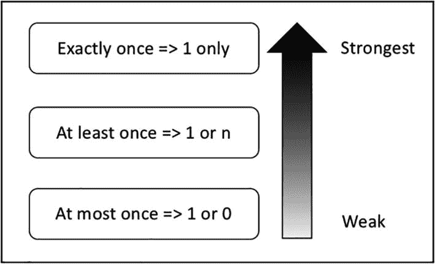
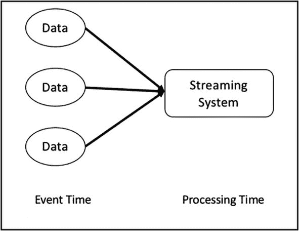
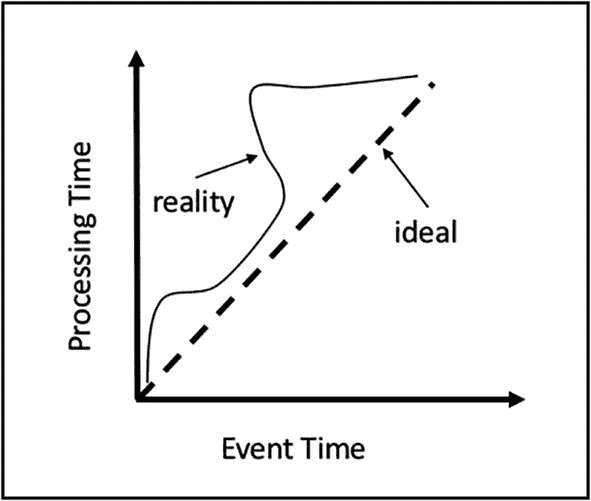
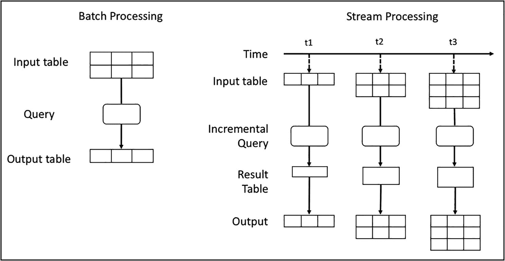
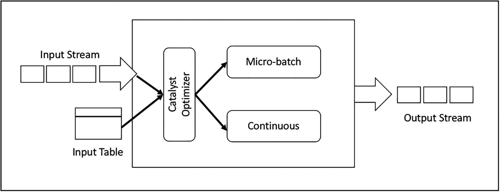

# 六、Spark 流

除了批量数据处理，流处理已经成为任何企业利用实时数据的价值来增加竞争优势、做出更好的业务决策或改善用户体验的必备能力。随着物联网的出现，实时数据的数量和速度都在增加。对于像脸书、LinkedIn 或 Twitter 这样的互联网公司来说，他们平台上每秒发生的数百万次社交活动都被表示为流媒体数据。

在高层次上，流处理是指对无限数据流的连续处理。以容错和一致的方式大规模做到这一点是一项具有挑战性的任务。幸运的是，像 Spark、Flink、Samza、Heron 和 Kafka 这样的流处理引擎在过去几年中已经稳定而显著地成熟，使企业能够比以前更容易地构建和操作复杂的流处理应用程序。

随着社区了解如何最好地将日益成熟的流媒体引擎应用于其业务需求，更多有趣的实时数据处理用例应运而生。例如，优步利用流处理能力实时了解其平台上的乘客和司机数量。这些近乎实时的洞察会影响商业决策，比如将多余的司机从一个城市的低需求区域转移到高需求区域。

大多数互联网公司在发布新功能或尝试新设计时，都会利用实验系统来执行 A/B 测试。流处理通过将理解实验有效性所需的时间从几天减少到几个小时，实现了对实验更快的反应。

欺诈检测是一个张开双臂拥抱流处理的领域，因为它从即时洞察欺诈活动中获得了好处，因此可以阻止或监控欺诈活动。对于拥有数百项在线服务的大型公司来说，一个常见的需求是通过流处理以接近实时的方式处理大量生成的日志来监控其运行状况。还有许多更有趣的实时数据处理用例，其中一些将在本章中分享。

本章首先描述有用的流处理概念，然后简要介绍流处理引擎的前景。然后本章的其余部分将详细描述 Spark 流处理引擎及其 API。

## 流处理

在大数据领域，自从 Hadoop 问世以来，批量数据处理就广为人知。流行的 MapReduce 框架是 Hadoop 生态系统中的组件之一，由于其功能和健壮性，它成为了批量数据处理之王。在批量数据处理领域经过一段时间的创新之后，现在已经很好地理解了这个领域的大多数挑战。从那时起，大数据开源社区已经将其重点和创新转移到了流处理领域。

批量数据处理通过固定大小的静态输入数据集应用计算逻辑，并最终生成结果。这意味着处理在到达数据集的末尾时停止。相比之下，流处理是通过无界的数据流运行计算逻辑，因此处理是连续的和长期运行的。尽管批数据和流数据之间的差异主要在于有限性，但是流处理比批数据处理更复杂和更具挑战性，因为数据的无界性质、实时数据的传入顺序、数据到达的不同速率以及面对机器故障时对正确性和低延迟的期望。

在批量数据处理领域，经常听说由于输入数据集的大小而需要花费数小时来完成复杂的批量数据处理作业。

人们期望流处理引擎必须通过尽可能高效地向应用交付传入的数据流来提供低延迟和高吞吐量，以便它们能够快速做出反应或提取洞察力。执行任何有趣和有意义的流处理通常涉及以容错方式维护状态。例如，股票交易流应用程序想要维护和显示全天交易最活跃的前 10 或 20 只股票。为了实现这个目标，每个股票的运行计数必须由代表应用程序的流处理引擎或者由应用程序本身来维护。通常，状态保存在内存中，并由磁盘等弹性存储支持，这种存储对机器故障具有弹性。

流处理不能在竖井中工作。有时需要与批处理数据一起工作，以丰富传入的流数据。一个很好的例子是当页面视图流应用程序需要基于用户位置计算其用户的页面视图统计时；然后，它需要将用户点击数据与会员数据连接起来。一个好的流处理引擎应该提供一种简单的方法来连接批量数据和流数据，而不需要太多的努力。

流处理的一个常见用例是对传入数据执行一些聚合，然后将汇总的数据写入外部数据接收器，供 web 应用程序或数据分析引擎使用。这里的期望是，无论是由于机器故障还是数据处理应用程序中的一些错误，在面对故障时，具有端到端的恰好一次的数据保证。这里的关键是流处理引擎如何处理故障，使得传入的数据不会丢失和重复计算。

随着流处理引擎的成熟，它们提供了快速、可伸缩和容错的分布式系统属性，以及开发人员友好的方式，通过将低级 API 的抽象提升到 SQL 这样的高级声明性语言来执行数据流计算。凭借这一进步，构建自助服务流平台变得更加容易，产品团队可以通过利用各种公司产品生成的数据或事件，快速做出有意义的业务决策。请记住，数据流处理的目标之一是及时提取业务洞察，以便企业能够快速做出反应或采取业务行动。

总的来说，流处理有它自己的一套独特的挑战，这些挑战是由于处理连续的和无限的数据而产生的。当您开始构建长期运行的流处理应用程序或评估特定的流处理引擎时，注意这些挑战是很重要的。挑战如下。

*   为数据流应用程序可靠地维护潜在的大状态

*   高效快速地传递消息供应用程序处理

*   处理无序到达的流数据

*   加入批量数据以丰富传入的流数据

*   端到端恰好一次保证数据传送，即使出现故障

*   处理不均匀的数据到达率

### 概念

要执行流处理，必须理解以下核心和有用的概念。这些重要的概念非常适用于在任何流处理引擎上开发流应用程序。了解它们有助于评估流处理引擎；它们还使您能够提出正确的问题，以了解特定的流处理引擎在每个领域提供了多少支持。

*   数据交付语义

*   时间的概念

*   开窗术

#### 数据交付语义

当一条数据进入流处理引擎时，它负责将其交付给流应用程序进行处理。即使在故障情况下，流处理引擎也可以提供三种类型的保证。

*   **最多一次**:这意味着一个流处理引擎保证一个数据只被传递给一个应用程序一次，但也可能是零次。换句话说，有可能丢失一部分数据，因此应用程序根本看不到它。对于一些用例来说，这是可以接受的，但是对于其他一些用例来说，这是不可以接受的。其中一个用例是金融交易处理应用程序。丢失数据会导致不向客户收费，从而减少收入。

*   **至少一次**:这意味着流处理引擎保证一段数据被一次或多次传递给应用程序。在这种情况下没有数据丢失；然而，有可能出现双重或三重计算。在金融交易处理应用程序的例子中，一个交易被多次应用，导致客户投诉。这种保证比最多一次强，因为没有数据丢失。

*   **恰好一次**:这意味着一个流处理引擎保证一段数据只被传递给一个应用程序一次，不多也不少。在这种情况下，没有数据丢失，也没有重复计算。大多数现代和流行的流处理引擎都提供了这种保证。在这三个保证中，这一个是构建关键业务流应用程序最理想的。

看待这些交付语义的一种方式是，它们属于一个范围，其中最多一次是最弱的保证，恰好一次是最强的保证，如图 6-1 所示。



图 6-1

交付语义谱

在评估流处理引擎时，了解它提供的保证级别以及这种保证背后的实现非常重要。大多数现代的流处理引擎采用检查点和预写日志技术的组合来提供恰好一次的保证。

#### 时间的概念

在流处理的世界中，时间的概念非常重要，因为它使您能够理解在时间方面发生了什么。例如，在实时异常检测应用程序的情况下，时间的概念提供了对在最后 5 分钟或一天的某个部分发生的可疑交易的数量的洞察。

有两种重要的时间类型:事件时间和处理时间。如图 6-2 所示，事件时间代表创建数据的时间，该信息通常编码在数据中。例如，在世界上某个地方测量海洋温度的物联网设备中，事件时间是测量温度的时间。温度数据的编码可以由温度本身和时间戳组成。处理时间表示流处理引擎处理一段数据的时间。在海洋温度物联网设备的示例中，处理时间是流处理引擎开始对温度数据执行转换或聚合时的时钟时间。



图 6-2

事件时间和处理

要真正了解传入数据流背后的情况，必须按照偶数时间来处理传入数据，因为事件时间代表数据创建的时间点。在理想状态下，数据在创建后不久就到达并被处理，因此事件时间和处理时间之间的间隔很短。事实往往并非如此，因此，根据阻止数据在创建后立即到达的条件，延迟会随着时间而变化。滞后越大，就越需要使用事件时间而不是处理时间来处理数据。

图 6-3 展示了事件时间和处理时间之间的关系，以及一个真实延迟的例子。时间的概念与窗口的概念密切相关，这将在下面描述。为了处理无限制的传入数据流，流处理引擎中的一种常见做法是通过使用开始和结束时间作为边界，将传入数据分成块。使用事件时间作为时间边界更有意义。



图 6-3

事件时间和处理时间之间的延迟

#### 开窗术

考虑到流数据的无界特性，拥有输入流数据的全局视图是不可行的。因此，要从传入的数据中提取任何有意义的值，您必须分块处理它们。例如，假设交通计数传感器每 20 秒发出一次汽车数量的计数，计算最终总和是不可行的。相反，问每分钟或每五分钟有多少辆车经过那个传感器更符合逻辑。在这种情况下，您需要将流量计数数据分别划分为 1 分钟或 5 分钟的数据块。每个块被称为一个窗口。

窗口是一种常见的流处理模式，在这种模式下，不受限制的传入数据流基于时间边界(事件时间或处理时间)被划分为多个块。虽然前者更常用于反映数据的实际情况。但是，考虑到数据可能不会按照创建的顺序到达，或者由于网络拥塞而延迟，因此不可能总是在该时间窗口内创建所有数据。

有三种常用的窗口模式，大多数现代流处理引擎都支持它们。这三种模式如图 6-4 所示。


图 6-4

三种常用的窗口模式

固定/滚动窗口将传入的数据流分成固定大小的数据段，每个数据段都有一个窗口长度、开始时间和结束时间。每个到来的数据片段被插入一个且仅一个固定/翻转窗口。有了每个窗口中的这一小批数据，在执行 sum、max 或 average 等聚合时就很容易推理了。

滑动窗口是将传入数据流分成固定大小的段的另一种方式，其中每个段都有一个窗口长度和滑动间隔。如果滑动间隔与窗口长度大小相同，则它与固定/滚动窗口相同。图 6-4 中的例子显示滑动间隔小于窗口长度。这意味着一条或多条数据包含在不止一个滑动窗口中。由于窗口的重叠，聚集产生比固定/滚动窗口更平滑的结果。

会话窗口类型通常用于分析网站上的用户行为。与固定/翻转和滑动窗口不同，它没有预先确定的窗口长度。相反，它通常由大于某个阈值的不活动间隙来确定。例如，脸书上会话窗口的长度由用户活动的持续时间决定，比如浏览用户提要、发送消息等等。

### 流处理引擎前景

开源社区在提出流处理解决方案方面不乏创新。事实上，有多种选择来选择流处理引擎。早期的一些流处理引擎是出于需要而诞生的，后来的一些是出于研究项目而诞生的，还有一些是由批处理引擎演变而来的。本节介绍一些流行的流处理引擎:Apache Storm、Apache Samza、Apache Flink、Apache Kafka Streams、Apache Apex 和 Apache Beam。

Apache Storm 是流处理的先驱之一，它的流行主要与 Twitter 所做的大规模流处理有关。Apache Storm 最初发布是在 2011 年，2014 年成为 Apache 顶级项目。2016 年，Twitter 放弃了阿帕奇 Storm，转而使用 Heron，这是阿帕奇 Storm 的下一代。Heron 比 Apache Storm 更节省资源并提供更好的吞吐量。

Apache Samza 诞生于 LinkedIn，以帮助解决其流处理需求，并于 2013 年开源。它旨在与 Kafka 紧密合作，并运行在 Hadoop YARN 之上，以实现进程隔离、安全性和容错。Apache Samza 设计用于处理流，流由有序的、分区的、可重放的和容错的不可变消息集组成。

Apache Flink 最初是一个名为“同温层:云上的信息管理”的研究项目的分支。它在 2015 年成为了 Apache 的顶级项目，从那以后，它作为一个高吞吐量和低延迟的流媒体引擎逐渐受到欢迎。Apache Flink 与 Apache Storm 和 Apache Samza 之间的一个关键区别是，它在同一个引擎中支持批处理和流处理。

Apache Kafka 已经从一个分布式发布-订阅消息传递系统发展成为一个分布式流平台。它创建于 LinkedIn，并于 2012 年成为 Apache 的顶级项目。与其他流处理引擎不同，Kafka 的流处理功能被打包为一个轻量级库，这使得编写实时流应用程序非常容易。

Apache Apex 相对来说是这个领域的新手。它是由一家名为 DataTorrent 的公司开发的，他们决定在 2016 年开源它。Apache Apex 被认为是统一了流和批处理的 Hadoop YARN 原生平台。

Apache Beam 是 2016 年从 Google 出来的一个相当有趣的项目。这个项目背后的主要思想是为流和批处理提供一个强大且易于使用的通用抽象层，可跨各种运行时平台(如 Apache Flink、Apache Spark、Google Cloud DataFlow)移植。换句话说，可以把 Apache Beam 看作是大数据处理的超级 API。

有两个标准的流处理模型，每个流处理引擎(Apache Beam 除外)都订阅了其中的一个。这两种模式分别称为*一次记录*和*微量配料*，如图 6-5 所示。


图 6-5

两种不同的流处理模型

这两种模式都有固有的优点和缺点。一次记录的模式确实如其名。它会在每一条传入的数据到达时立即进行处理。因此，该模型可以提供毫秒级的低延迟。微批处理模型根据可配置的批处理时间间隔等待并累积一小批输入数据，并并行处理每批数据。微批处理模型无法提供与其他模型相同的延迟水平。就吞吐量而言，微批处理具有更高的速率，因为一批数据是以优化的方式处理的，因此与其他模型相比，每份数据的成本较低。一个有趣的附带说明是，在时间记录模型的基础上构建微批处理模型相当容易。

在所有讨论的流处理引擎中，只有 Apache Spark 采用了微批处理模型；然而，一些支持一次记录模式的工作已经在进行中。

## Spark 流概述

Apache Spark 的统一数据处理平台受欢迎的原因之一是能够执行流处理和批量数据处理。

在高层次描述了流处理的复杂性和挑战以及一些核心概念之后，本章的剩余部分将重点讨论 Spark 流主题。首先，它提供了对 Spark 的第一代流处理引擎 DStream 的简短和高层次的理解。然后剩余章节的大部分提供了关于 Spark 的第二个流处理引擎结构化流的信息。

新的 Spark 流应用程序应该在结构化流的基础上开发，以利用它提供的一些独特的高级功能。

## 司库流

第一代 Spark stream 处理引擎于 2012 年推出，该引擎中的主要编程抽象称为*离散化流*、或 d stream。它的工作原理是使用微批处理模型将传入的数据流分成几批，然后由 Spark 批处理引擎进行处理。这在 RDD 是主要编程抽象模型的时候很有意义。每个批次在内部由一个 RDD 代表。一批数据的数量是输入数据速率和批间隔的函数。图 6-6 直观地描述了 DStream 的高级工作方式。


图 6-6

司库流

可以从 Kafka、AWS Kinesis、文件或套接字的输入数据流创建数据流。创建数据流时需要的关键信息之一是批处理间隔，它可以以秒或毫秒为单位。使用数据流，您可以对输入的数据流应用高级数据处理功能，如`map`、`filter`、`reduce`或`reduceByKey`。此外，您可以通过提供窗口长度和滑动间隔来执行窗口操作，如减少和计数固定/翻转或滑动窗口。一个重要的注意事项是，窗口长度和滑动间隔必须是批处理间隔的倍数。例如，如果批处理间隔是三秒，并且使用固定/滚动间隔，则窗口长度和滑动间隔可以是六秒。虽然 DStream 支持在执行批量数据计算时保持任意状态，但这是一个手动过程，有点麻烦。用一个数据流可以做的一件很酷的事情是将它与另一个数据流或表示静态数据的 RDD 连接起来。完成所有处理逻辑后，可以使用 DStream 将数据写出到外部系统，如数据库、文件系统或 HDFS。

新的 Spark 流应用程序应该在第二代 Spark 流处理引擎上开发，称为结构化流，这将在下一节中介绍。在本节的剩余部分，您将看到一个字数很少的 Spark DStream 应用程序；目标是理解典型的 Spark DStream 应用程序是什么样子的。清单 6-1 包含字数统计应用程序的代码，这是来自 Apache Spark 源代码 GitHub 库的一个例子(参见 [`https://bit.ly/2G8N30G`](https://bit.ly/2G8N30G) )。

```scala
object NetworkWordCount {
  def main(args: Array[String]) {

    // Create the context with a 1 second batch size
    val sparkConf = new SparkConf().setAppName("NetworkWordCount")
    val ssc = new StreamingContext(sparkConf, Seconds(1))

    val host = "localhost"
    val port = 9999

    val lines = ssc.socketTextStream(host, port, StorageLevel.MEMORY_AND_DISK_SER)
    val words = lines.flatMap(_.split(" "))
    val wordCounts = words.map(x => (x, 1)).reduceByKey(_ + _)

    wordCounts.print()

    ssc.start()
    ssc.awaitTermination()
  }
}

Listing 6-1Apache Spark DStream Word Count application

```

组装 DStream 应用程序有几个重要步骤。数据流应用程序的入口点是 StreamingContext。其中一个必需的输入是批处理间隔，它定义了 Spark 将一组输入数据批处理到 RDD 进行处理的持续时间。它还代表了 Spark 何时应该执行流应用计算逻辑的触发点。例如，如果批处理时间间隔是 3 秒，Spark 将对在 3 秒间隔内到达的所有数据进行批处理。间隔过后，它会将该批数据转换为 RDD，并根据您提供的处理逻辑进行处理。一旦创建了 StreamingContext，下一步将通过定义输入源来创建实例 DStream。该示例将输入源定义为读取文本行的套接字。在这一点上，然后你为新创建的数据流提供处理逻辑。前面示例中的处理逻辑并不复杂。一旦 1 秒钟后一组行的 RDD 可用，Spark 就执行将每一行拆分成单词的逻辑，将每个单词转换成该单词的元组和计数 1，最后对同一单词的所有计数求和。

最后，计数会在控制台上打印出来。请记住，流式应用程序是一个长期运行的应用程序；因此，它需要一个信号来开始接收和处理输入的数据流。该信号是通过调用 StreamingContext `start()`函数给出的，这通常在文件末尾完成。`awaitTermination()`函数等待流媒体应用程序停止执行，并等待一种机制来防止驱动程序在流媒体应用程序运行时退出。在一个典型的程序中，一旦最后一行代码被执行，它就退出。然而，一个长时间运行的流媒体应用程序需要在启动后保持运行，并且只有在您显式停止它时才会结束。

像大多数第一代流处理引擎一样，DStream 也有一些缺点。

*   对事件时间的本机支持:对于大多数流处理应用程序来说，基于事件时间提取洞察力或聚合是极其重要的。不幸的是，DStream 没有为这种需求提供本地支持。

*   批处理和流处理的独立 API:Spark 开发人员需要学习不同的 API 来构建批处理和流处理应用程序。这不是 DStream 的错，因为在 DStream 发明的时候，结构化 API 还不可用。

### Spark 结构化流

结构化流媒体是 Spark 的第二代流媒体引擎。它被设计得更快、更可伸缩、更容错，并解决了第一代流媒体引擎的缺点。它旨在让开发人员构建端到端的流应用，使用简单的编程模型对数据做出实时反应，该模型构建在 Spark SQL 引擎的优化和坚实基础之上。结构化流的一个显著特点是，它为 Spark 用户和开发人员提供了一种独特而简单的方式来构建流应用程序。

构建生产级流媒体应用需要克服许多挑战，考虑到这一点，结构化流媒体引擎旨在帮助应对这些挑战。

*   处理端到端可靠性并保证正确性

*   能够对各种输入数据执行复杂的转换

*   基于事件时间处理数据，轻松处理无序数据

*   与各种数据源和数据接收器集成

以下部分涵盖了结构化流媒体引擎的各个方面及其应对这些挑战的支持。

### 概观

结构化流有两个关键的想法。第一种方法以批处理计算的方式处理流计算。这意味着将传入的数据流视为输入表，当一组新的数据到达时，将其视为附加到输入表的一组新的行(见图 6-7 )。


图 6-7

将流数据视为不断更新的表

另一种思考传入数据流的方式是，只不过是一个不断追加的表。这个简单而激进的想法有很多含义。其中之一是利用 Scala、Java 或 Python 中现有的用于数据帧和数据集的结构化 API 来执行流计算。当新的流数据到达时，结构化流引擎负责增量地和连续地运行它们。图 6-8 提供了在 Spark 中执行批处理和流处理的直观比较。另一个含义是，在第五章中讨论的相同 Catalyst 引擎优化了通过结构化 API 表达的流计算逻辑。您从使用结构化 API 中获得的知识可以直接转移到构建在 Spark 结构化流引擎上运行的流应用程序中。剩下唯一需要学习的部分是特定于流处理领域的部分，比如事件时处理和维护状态。



图 6-8

Spark 中批处理和流处理的比较

第二个关键思想是与存储系统的事务集成，以提供端到端的一次性保证。这里的目标是确保从存储系统读取数据的服务应用程序看到已由流式应用程序处理的数据的一致快照。传统上，在将数据从流式应用程序发送到外部存储系统时，确保没有重复数据或数据丢失是开发人员的责任。这是流式应用程序开发人员提出的难题之一。在内部，结构化流引擎已经提供了“恰好一次”的保证，现在这种保证扩展到了外部存储系统，前提是这些系统支持事务。

从 Apache Spark 2.3 开始，结构化流媒体引擎的处理模型已经扩展到支持一个名为*连续处理*的新模型。之前的处理模型是微批处理模型，这是默认的模型。鉴于微批处理模型的性质，它适合于可以容忍 100 毫秒范围内的端到端延迟的用例。对于其他需要低至 1 毫秒的端到端延迟的用例，他们应该使用连续处理模型；但是，从 Apache Spark 2.3 版本开始，它就处于实验状态。它在支持什么样的流计算方面有一些限制。

### 核心概念

本节涵盖了在构建流应用程序之前需要理解的一组核心概念。流式应用程序的主要部分包括:指定一个或多个流式数据源，以数据帧转换的形式提供操作传入数据流的逻辑，定义输出模式和触发器，以及最终指定将结果写入的数据接收器。因为输出模式和触发器都有默认值，如果它们的默认值符合您的用例，它们就是可选的。图 6-9 概述了这些步骤。可选的标有星号。


图 6-9

结构化流应用程序的核心部分

下面几节将详细描述这些概念。

#### 数据源

先说数据来源。对于批处理，数据源是一个静态数据集，驻留在本地文件系统、HDFS 或 S3 等存储系统上。结构化流中的数据源非常不同。它们持续生成数据，并且速率会随着时间而变化。结构化流为以下来源提供本机支持。

*   **Kafka 源码**:需要 0.10 以上版本的 Apache Kafka。这是生产环境中最流行的数据源。使用这个数据源需要对 Kafka 的工作原理有一个基本的了解。连接到 Kafka 主题并从中读取数据需要一组必须提供的特定设置。更多信息请参考 Spark 网站上的 Kafka 集成指南( [`https://spark.apache.org/docs/latest/structured-streaming-kafka-integration.html`](https://spark.apache.org/docs/latest/structured-streaming-kafka-integration.html) )。

*   **文件源**:位于 HDFS 或 S3 本地文件系统的文件。当新文件被放入一个目录中时，这个数据源会拾取它们进行处理。支持常用的文件格式，如 text、CSV、JSON、ORC 和 Parquet。有关支持的文件格式的最新列表，请参见 DataStreamReader 接口。使用此数据源时，一个好的做法是完全写入输入文件，然后将它们移动到此数据源的路径中。

*   **插座源**:这仅用于测试目的。它从监听某个主机和端口的套接字读取 UTF8 数据。

*   **费率来源**:仅用于测试和基准测试。这个源可以配置为每秒生成几个事件，其中每个事件由一个时间戳和一个单调递增的值组成。这是学习结构化流时最容易使用的资源。

数据源需要为结构化流提供的一个重要属性是标记，以提供端到端的一次性保证。当需要重新处理时，它可以倒回该位置。例如，Kafka 数据源提供了一个 Kafka 偏移量来跟踪主题的分区的读取位置。此属性确定特定数据源是否具有容错能力。表 6-1 描述了每个现成数据源的一些选项。

表 6-1

现成的数据源

<colgroup><col class="tcol1 align-left"> <col class="tcol2 align-left"> <col class="tcol3 align-left"></colgroup> 
| 

名字

 | 

容错的

 | 

配置

 |
| --- | --- | --- |
| 文件 | 是 | `path`:输入目录的路径`maxFilesPerTrigger`:每个触发器要读取的新文件的最大数量`latestFirst`:是否处理最新的文件(根据修改时间)。 |
| 窝 | 不 | 以下是必需的`host`:要连接的主机`port`:要连接的端口 |
| 速度 | 是 | `rowsPerSecond`:每秒生成的行数`rampUpTime`:到达`rowsPerSecond`之前的上升时间(秒)`numPartitions`:分区数量 |
| 卡夫卡 | 是 | `kafka.bootstrap.servers`:逗号分隔的卡夫卡经纪人`host:port`列表`subscribe`:逗号分隔的主题列表更多信息请参考 Spark 网站上的 Kafka 集成指南。 |

Apache Spark 2.3 引入了数据源 V2 API，这是一组官方支持的接口，用于 Spark 开发人员开发可以轻松与结构化流集成的自定义数据源。有了这些定义良好的 API，定制的结构化流媒体源的数量会显著增加。

#### 输出模式

输出模式是告诉结构化流应该如何将输出数据写入接收器的一种方式。这个概念是 Spark 中流处理所独有的。有三种选择。

*   **追加模式**:如果没有指定输出模式，这是默认模式。在这种模式下，只有追加到结果表中的新行被发送到指定的输出接收器。

*   **完成模式**:将整个结果表写入输出接收器。

*   **更新模式**:只有结果表中更新的行被写入输出接收器。这意味着未更改的行不会被写出。

各种输出模式的语义需要一些时间来适应，因为它们有几个维度。有了这三种选择，很自然地会想，在什么情况下你会使用一种输出模式而不是其他模式。希望，当你浏览一些例子时，它会更有意义。

#### 触发器类型

触发器是另一个需要理解的重要概念。结构化流引擎使用触发信息来确定何时对新发现的流数据执行所提供的流计算逻辑。表 6-2 描述了不同的触发类型。

表 6-2

触发器类型

<colgroup><col class="tcol1 align-left"> <col class="tcol2 align-left"></colgroup> 
| 

类型

 | 

描述

 |
| --- | --- |
| 未规定的(默认) | 对于这种默认类型，Spark 使用微批处理模式，并在前一批数据完成处理后立即处理下一批数据。 |
| 固定间隔 | 对于这种类型，Spark 使用微批量模式，并根据用户提供的时间间隔处理批量数据。如果前一批数据的处理时间长于间隔时间，则前一批数据完成后会立即处理下一批数据。换句话说，Spark 不会等到下一个区间边界。 |
| 一次性的 | 这种触发类型旨在用于一次性处理一批可用数据，一旦处理完成，Spark 会立即停止流应用程序。当数据量极低时，这种触发类型非常有用，因此，一天只处理几次数据会更加经济高效。 |
| 连续的 | Spark 使用新的低延迟和连续处理模式执行您的流应用程序逻辑。 |

#### 数据接收器

数据接收器位于数据源的另一端。它们用于存储流应用程序的输出。了解哪些接收器可以支持哪种输出模式以及它们是否具有容错能力非常重要。此处提供了每个水槽的简短描述，表 6-3 中概述了每个水槽的各种选项。

表 6-3

现成的数据接收器

<colgroup><col class="tcol1 align-left"> <col class="tcol2 align-left"> <col class="tcol3 align-left"> <col class="tcol4 align-left"></colgroup> 
| 

名字

 | 

支持

输出模式

 | 

故障

容忍的

 | 

配置

 |
| --- | --- | --- | --- |
| 文件 | 附加 | 是 | 路径:输入目录的路径支持所有流行的文件格式。有关更多信息，请参见 DataFrameWriter。 |
| 为每一个 | 追加，更新，完成 | 依赖 | 这是一个非常灵活的接收器，并且是特定于实现的。详见以下内容。 |
| 安慰 | 追加，更新，完成 | 不 | numRows:每个触发器要打印的行数。默认值为 20 行 truncate:如果每行都太长，是否截断。默认值为 true。 |
| 记忆 | 追加，完成 | 不 | 不适用的 |
| 卡夫卡 | 追加，更新，完成 | 是 | kafka.bootstrap.servers:逗号分隔的主机列表:kafka 代理的端口主题:要写入数据的 Kafka 主题。更多信息请参考 Spark 网站上的 Kafka 集成指南。 |

*   **Kafka sink** :需要 0.10 以上版本的 Apache Kafka。连接到 Kafka 集群有一组特定的设置。更多信息请参考 Spark 网站上的 Kafka 集成指南。

*   **文件接收器**:这是文件系统上的一个目的地，HDFS 或 S3。支持常用的文件格式，如 text、CSV、JSON、ORC 和 Parquet。有关支持的文件格式的最新列表，请参见`DataStreamReader`界面。

*   **Foreach sink** :这意味着对输出中的行运行任意计算。

*   **控制台接收器**:这仅用于测试和调试目的，并且在处理少量数据时使用。每次触发时，输出都会打印到控制台。

*   **内存接收器**:这仅用于处理少量数据时的测试和调试目的。它使用驱动程序的内存来存储输出。

数据接收器必须支持结构化流以提供端到端和一次性保证的一个重要属性是处理再处理的幂等性。换句话说，它必须能够处理同一数据的多次写入(发生在不同的时间),这样结果就如同只有一次写入一样。多次写入是在故障情况下重新处理数据的结果。

下一节将使用示例来演示在开发 Spark 结构化流应用程序时各个部分是如何组合在一起的。

#### 水印

水印是流处理引擎中常用的技术，用于处理到达时间比几乎同时创建的其他数据晚得多的数据。当流计算逻辑需要维护某种状态时，后期数据给流处理引擎带来了挑战。这种情况的例子是正在进行聚合或连接。流式应用程序开发人员可以指定一个阈值，让结构化流式引擎知道数据在事件时间内预计会迟到多长时间。有了这些信息，结构化流引擎就可以决定是处理还是丢弃一条最新数据。

更重要的是，结构化流使用指定的阈值来确定何时可以丢弃旧状态。如果没有这些信息，结构化流需要无限期地维护所有状态，这会导致流应用程序出现内存不足的问题。任何执行聚合或连接的生产结构化流应用程序都需要指定水印。这是一个重要的概念，关于这个主题的更多信息将在后面的章节中讨论和说明。

### 结构化流应用

本节将通过一个 Spark 结构化流示例应用程序来了解概念是如何映射到代码中的。以下示例是关于处理来自文件数据源的一小组移动动作事件。每个事件由三个字段组成。

*   **id** :代表手机的唯一 id。在提供的样本数据集中，电话 ID 类似于 phone1、phone2、phone3。

*   **动作**:表示用户采取的动作。动作的可能值为打开和关闭

*   **ts** :表示用户采取动作时的时间戳。这是活动时间。

移动事件数据被分成三个 JSON 文件，它们位于`chapter6/data/mobile`目录中。为了模拟数据流行为，JSON 文件按照一定的顺序被复制到输入文件夹中，然后检查输出以验证您的理解。

让我们通过使用 DataFrames 读取数据来研究移动事件数据(参见清单 6-2 )。

```scala
val mobileDataDF = spark.read.json("<path>/chapter6/data/mobile")

mobileDataDF.printSchema
 |-- action: string (nullable = true)
 |-- id: string (nullable = true)
 |-- ts: string (nullable = true)

file1.json
{"id":"phone1","action":"open","ts":"2018-03-02T10:02:33"}
{"id":"phone2","action":"open","ts":"2018-03-02T10:03:35"}
{"id":"phone3","action":"open","ts":"2018-03-02T10:03:50"}
{"id":"phone1","action":"close","ts":"2018-03-02T10:04:35"}

file2.json
{"id":"phone3","action":"close","ts":"2018-03-02T10:07:35"}
{"id":"phone4","action":"open","ts":"2018-03-02T10:07:50"}

file3.json
{"id":"phone2","action":"close","ts":"2018-03-02T10:04:50"}
{"id":"phone5","action":"open","ts":"2018-03-02T10:10:50"}

Listing 6-2Reading in Mobile Data and Printing Its Schema

```

默认情况下，当从基于文件的数据源读取数据时，结构化流需要一个架构。这是有意义的，因为当目录为空时，不可能推断输入流数据的模式。但是，如果您希望它推断模式，您可以将配置`spark.sql.streaming.schemaInference`设置为 true。在本例中，您显式创建了一个模式。清单 6-3 包含了为移动事件数据创建模式的代码片段。

```scala
import org.apache.spark.sql.types._
import org.apache.spark.sql.functions._

val mobileDataSchema = new StructType()
                           .add("id", StringType, false)
                           .add("action", StringType, false)
                           .add("ts", TimestampType, false)

Listing 6-3Create a Schema for Mobile Event Data

```

让我们从处理移动事件数据的简单用例开始。我们的目标是使用十秒钟的固定窗口长度来生成每个动作类型的计数。清单 6-4 中的三行代码有助于实现这个目标。第一行展示了通过使用`DataStreamReader`类从目录中读取数据来使用基于文件的数据源。预期的数据格式是 JSON，模式由清单 6-3 中定义的三列组成。第一行返回的对象是`DataFrame`类的一个实例。与第四章所述的数据帧不同，该数据帧是一个流数据帧。您可以通过调用`isStreaming`函数来简单地确认这一点，返回值应该是 true。这个简单应用程序中的流计算逻辑在第二行中表示，它使用`action`列和基于`ts`列的固定窗口执行 group by 转换。group by 转换中的固定窗口基于嵌入在移动事件数据中的时间戳。第三行很重要，因为它定义了输出模式和数据宿。最重要的是，它告诉结构化流引擎开始增量运行第二行中表示的流计算逻辑。更详细地说，第三行代码使用`actionCountDF` DataFrame 的`DataFrameWriter`实例将控制台指定为数据接收器，这意味着输出被打印到控制台供您检查。然后它将输出模式定义为`"complete"`，这样您就可以看到结果表中的所有记录。最后，它调用`DataStreamWriter`类的`start()`函数开始执行，这意味着数据源开始处理放入`/<path>/chapter6/data/input`目录的文件。另一个需要注意的重要事情是，`start`函数返回一个`StreamingQuery`类的实例，代表一个查询的句柄，当新数据到达时，该查询在后台持续执行。您可以使用`mobileConsoleSQ`串流查询来检查串流应用程序中计算的状态和进度。

在输入清单 6-4 中的代码行之前，确保输入文件夹是空的。

```scala
// create a streaming DataFrame from reading data file in the specified directory
val mobileSSDF = spark.readStream.schema(mobileDataSchema)
                      .json("/<path>/chapter6/data/input")

mobileSSDF.isStreaming

// perform a group by using event time of column ts and fixed window of 10 mins
val actionCountDF = mobileSSDF.groupBy(window($"ts",
                                "10 minutes"), $"action").count

// start the streaming query and write the output to console
val mobileConsoleSQ = actionCountDF.writeStream
                  .format("console").option("truncate", "false")
                  .outputMode("complete")
                  .start()

Listing 6-4Generate a Count Per Action Type in a 10-Second Sliding Window

```

清单 6-4 中的`start()`函数触发 Spark 结构化流引擎开始监视输入文件夹，并在看到该文件夹中的新文件时开始处理数据。将`file1.json`文件从`chapter6/data/mobile`目录复制到`chapter6/data/input`目录后，输出控制台显示类似于清单 6-5 中的输出。

输出显示从 10:00 到 10:10 只有一个窗口，在这个窗口中，有一个关闭动作和三个打开动作，这应该与`files1.json`中的四行事件相匹配。现在对`file2.json,`重复相同的过程，输出应该与清单 6-6 匹配。`file2.json`数据文件包含一个具有打开动作的事件和另一个具有关闭动作的事件，并且这两个事件都在同一个窗口中。因此，活动类型的计数分别更新为两个关闭和四个打开。

```scala
-------------------------------------------
Batch: 1
-------------------------------------------
+----------------------------- --------------+--------+-------+
|                                      window|  action|  count|
+--------------------------------------------+--------+-------+
|  [2018-03-02 10:00:00, 2018-03-02 10:10:00]|  close |      2|
|  [2018-03-02 10:00:00, 2018-03-02 10:10:00]|  open  |      4|
+--------------------------------------------+--------+-------+

Listing 6-6Output from Processing file2.json

```

```scala
-------------------------------------------
Batch: 0
-------------------------------------------
+-----------------------------------------------+--------+------+
|                                         window|  action| count|
+-----------------------------------------------+--------+------+
|     [2018-03-02 10:00:00, 2018-03-02 10:10:00]|  close |     1|
|     [2018-03-02 10:00:00, 2018-03-02 10:10:00]|  open  |     3|
+-----------------------------------------------+--------+------+

Listing 6-5Output from Processing file1.json

```

此时，让我们调用查询流`mobileConsoleSQ`(一个`StreamingQuery`类的实例)的几个函数来检查状态和进度。`status()`函数告诉您在查询流的当前状态下发生了什么，查询流可能处于等待模式，也可能正在处理当前的一批事件。`lastProgress()`函数提供了关于最后一批事件处理的一些指标，包括处理速率、延迟等。清单 6-7 包含了这两个函数的样本输出。

```scala
scala> mobileConsoleSQ.status
res14: org.apache.spark.sql.streaming.StreamingQueryStatus =
{
  "message" : "Waiting for data to arrive",
  "isDataAvailable" : false,
  "isTriggerActive" : false
}

scala> mobileConsoleSQ.lastProgress
res17: org.apache.spark.sql.streaming.StreamingQueryProgress =
{
  "id" : "2200bc3f-077c-4f6f-af54-8043f50f719c",
  "runId" : "0ed4894c-1c76-4072-8252-264fe98cb856",
  "name" : null,
  "timestamp" : "2018-03-18T18:18:12.877Z",
  "batchId" : 2,
  "numInputRows" : 0,
  "inputRowsPerSecond" : 0.0,
  "processedRowsPerSecond" : 0.0,
  "durationMs" : {
    "getOffset" : 1,
    "triggerExecution" : 1
  },
  "stateOperators" : [ {
    "numRowsTotal" : 2,
    "numRowsUpdated" : 0,
    "memoryUsedBytes" : 17927
  } ],
  "sources" : [ {
    "description" : "FileStreamSource[file:<path>/chapter6/data/input]",
    "startOffset" : {
      "logOffset" : 1
    },
    "endOffset" : {
      "logOffset" : 1
    },
    "numInputRows" : 0,
    "inputRowsPerSecond" : 0.0,...

Listing 6-7Output from Calling status() and lastProgress() Functions

```

让我们处理完移动事件数据的最后一个文件。和`file2.json`一样。在`file3.json`被复制到输入目录后，输出应该如清单 6-8 所示。文件`file3.json`包含一个属于第一个窗口的关闭动作和一个从 10:10 到 10:20 落入新窗口的打开动作。总共有八个动作。其中七个落入第一个窗口，一个动作落入第二个窗口。

```scala
-------------------------------------------
Batch: 2
-------------------------------------------
+----------------------------------------------+--------+-------+
|                                        window|  action|  count|
+----------------------------------------------+--------+-------+
|    [2018-03-02 10:00:00, 2018-03-02 10:10:00]|   close|      3|
|    [2018-03-02 10:00:00, 2018-03-02 10:10:00]|    open|      4|
|    [2018-03-02 10:10:00, 2018-03-02 10:20:00]|    open|      1|
+----------------------------------------------+--------+-------+

Listing 6-8Output from Processing file3.json

```

在生产和长期运行的流应用中，需要调用`StreamingQuery.awaitTermination()`函数。这是一个阻塞调用，用于防止主线程进程退出，并使流式查询能够在新数据到达数据源时继续运行和处理新数据。当流式查询由于某些可预见的错误而失败时，此函数将失败。

学习结构化流时，您可能希望停止流查询以更改输出模式、触发器或其他配置。您可以使用`StreamingQuery.stop()`函数来停止数据源接收新数据，并停止流查询中逻辑的连续执行。清单 6-9 展示了管理流式查询的例子。

```scala
// this is blocking call
mobileSQ.awaitTermination()

// stop a streaming query
mobileSQ.stop

// another way to stop all streaming queries in a Spark application
for(qs <- spark.streams.active) {
    println(s"Stop streaming query: ${qs.name} - active:
              ${qs.isActive}")
    if (qs.isActive) {
      qs.stop
    }
}

Listing 6-9Managing Streaming Query

```

### 流式数据帧操作

清单 6-9 显示了一旦数据源被配置和定义，`DataStreamReader`返回一个 DataFrame 的实例——与您在第 3 和第四章中所熟悉的相同。这意味着您可以使用大多数操作和 Spark SQL 函数来表达您的应用程序的流计算逻辑。重要的是要注意，不是数据帧中的所有操作都被流数据帧支持。这是因为它们中的一些不适用于流处理，在流处理中数据是无限的。这种操作的例子包括`limit`、`distinct`、`cube`和`sort`。

#### 选择、项目、汇总操作

结构化流的卖点之一是 Spark 中一组用于批处理和流处理的统一 API。对于流式数据帧，可以对其应用任何选择和过滤转换，以及对各个列进行操作的任何 Spark SQL 函数。此外，第四章中涵盖的基本聚合和高级分析功能也可用于流式数据帧。流式数据帧可以注册为临时视图，然后对其应用 SQL 查询。清单 6-10 提供了一个在清单 6-4 中的`mobileSSDF`数据帧上过滤和应用 Spark SQL 函数的例子。

```scala
import org.apache.spark.sql.functions._
val cleanMobileSSDF = mobileSSDF.filter($"action" === "open"
                               || $"action" === "close")
                          .select($"id", upper($"action"), $"ts")

// create a view to apply SQL queries on
cleanMobileSSDF.createOrReplaceTempView("clean_mobile")
spark.sql("select count(*) from clean_mobile")

Listing 6-10Apply Filtering and Spark SQL Functions on a Streaming DataFrame

```

重要的是要注意，在流数据帧中还不支持以下数据帧转换，因为它们太复杂而无法维护状态，或者因为流数据的无限性质。

*   流式数据帧上的多个聚合或聚合链

*   限制并取 N 行

*   独特的转换(但是，有一种方法可以使用唯一标识符来消除重复数据。)

*   在没有任何聚合的情况下对流式数据帧进行排序(但是，在某种形式的聚合之后支持排序。)

任何试图使用不支持的操作都会导致`AnalysisException`异常。您会看到一条类似“流数据帧/数据集不支持 XYZ 操作”的消息。

#### 加入操作

对于流式数据帧，最酷的事情之一就是将它与静态数据帧或另一个流式数据帧连接起来。连接是一项复杂的操作，棘手之处在于，在连接时，并非流式数据帧的所有数据都可用。因此，连接的结果是在每个触发点以增量方式生成的，类似于聚合结果的生成方式。

从 Spark 版开始，结构化流支持连接两个流数据帧。考虑到流式数据帧的无界特性，结构化流式传输必须维护两个流式数据帧的过去数据，以匹配任何未来的、尚未接收的数据。为了避免结构化流必须保持的流状态的爆炸，可以可选地为两个流数据帧提供水印，并且必须在连接条件中定义对事件时间的约束。让我们来看一个物联网用例，它将数据中心的两个与数据传感器相关的数据流连接起来。第一个包含数据中心不同位置的温度读数。第二个包含同一数据中心中每台计算机的负载信息。这两股流的共同条件是位置。清单 6-11 包含关于在连接条件中提供水印和事件时间约束的代码。

```scala
import org.apache.spark.sql.functions.expr

// the specific streaming data source information is not important in this example
val tempDataDF = spark.readStream. ...
val loadDataDF = spark.readStream. ...

val tempDataWatermarkDF = tempDataDF.withWaterMark("temp_taken_time", "1 hour")
val loadDataWatermarkDF = loadDataDF.withWaterMark("load_taken_time", "2 hours")

// join on the location id as well as the event time constraint
tempWithLoadDataDF = tempDataWatermarkDF.join(loadDataWatermarkDF,
   expr(""" temp_location_id = load_location_id AND
            load_taken_time >= temp_taken_time AND
            load_taken_time <= temp_taken_time + interval 1 hour
        """)
)

Listing 6-11Joining Two Streaming DataFrames

```

当连接一个静态数据帧和一个流数据帧以及两个流数据帧时，对外部连接有更多的限制。表 6-4 提供了一些信息。

表 6-4

关于加入流数据帧的一些细节

<colgroup><col class="tcol1 align-left"> <col class="tcol2 align-left"> <col class="tcol3 align-left"></colgroup> 
| 

左侧+右侧

 | 

连接类型

 | 

注意

 |
| --- | --- | --- |
| 静态+流式 | 内部的 | 支持 |
| 静态+流式 | 左侧外部 | 不支持 |
| 静态+流式 | 右侧外部 | 支持 |
| 静态+流式 | 全外 | 不支持 |
| 流媒体+流媒体 | 内部的 | 支持 |
| 流媒体+流媒体 | 左侧外部 | 有条件支持。必须在右侧指定水印和时间限制 |
| 流媒体+流媒体 | 右侧外部 | 有条件支持。必须指定左边的水印和时间限制 |
| 流媒体+流媒体 | 全外 | 不支持 |

### 使用数据源

上一节描述了结构化流提供的每个内置源。这一节将更详细地介绍并提供使用它们的示例代码。

socket 和 rate 数据源都是仅为测试和学习目的而设计的，它们不应该用于生产中。

#### 使用套接字数据源

socket 数据源很容易使用，它只需要关于要连接的主机和端口的信息。在开始对 socket 数据源进行流查询之前，首先使用网络实用程序命令行实用程序(比如 macOS 上的`nc`或 Windows 上的`netcat`)启动一个 socket 服务器是很重要的。在这个例子中，使用了`nc`网络实用程序，您需要打开两个终端。第一个用于启动端口号为 9999 的套接字服务器；命令是`nc -lk 9999`。第二个是用清单 6-12 中的代码运行 Spark shell。

```scala
val socketDF = spark.readStream.format("socket")
                               .option("host", "localhost")
                               .option("port", "9999").load()

val words = socketDF.as[String].flatMap(_.split(" "))
val wordCounts = words.groupBy("value").count()

val query = wordCounts.writeStream.format("console")
                      .outputMode("complete")
                      .start()

Listing 6-12Reading Streaming Data from Socket Data Source

```

现在回到第一个终端，键入`Spark is great`，并按回车键。然后键入`Spark is awesome`并按回车键。按回车键告诉 Netcat 服务器将输入的内容发送给套接字侦听器。如果一切顺利，Spark shell 控制台中应该有两个输出批处理，如清单 6-13 所示，每个批处理都包含每个单词的计数。由于结构化流跨批次维护状态，它能够将单词`Spark`和`is`的计数更新为 2。

```scala
-------------------------------------------
Batch: 0
-------------------------------------------

+--------+-------+
|   value|  count|
+--------+-------+
|   great|      1|
|      is|      1|
|   Spark|      1|
+--------+-------+

-------------------------------------------
Batch: 1
-------------------------------------------
+------------+-------+
|       value|  count|
+------------+-------+
|       great|      1|
|          is|      2|
|     awesome|      1|
|       Spark|      2|
+------------+-------+

Listing 6-13Output of Socket Data Source in Spark-Shell Console

```

当您测试完套接字数据源后，可以通过调用`stop`函数来停止流式查询，如清单 6-14 所示。

```scala
query.stop

Listing 6-14Stop a Streaming Query of Socket Data Source

```

#### 使用比率数据源

像 socket 数据源一样，rate 数据源只是为了测试和学习目的而设计的。它支持几个选项，其中最关键的一个是每秒生成的行数。如果这个数字很高，那么可以提供另一个可选配置来指定达到每秒行数的上升时间。比率源产生的每条数据包含两列:时间戳和自动增量值。清单 6-15 包含从 rate 数据源打印数据的代码，以及第一批数据在控制台中的样子。

```scala
// configure it to generate 10 rows per second
val rateSourceDF = spark.readStream.format("rate")
                                   .option("rowsPerSecond","10")
                                   .load()

val rateQuery = rateSourceDF.writeStream
                            .outputMode("update")
                            .format("console")
                            .option("truncate", "false")
                            .start()
-------------------------------------------
Batch: 1
-------------------------------------------
+--------------------------------+-------+
|                       timestamp|  value|
+--------------------------------+-------+
|         2018-03-19 10:30:21.952|   0   |
|         2018-03-19 10:30:22.052|   1   |
|         2018-03-19 10:30:22.152|   2   |
|         2018-03-19 10:30:22.252|   3   |
|         2018-03-19 10:30:22.352|   4   |
|         2018-03-19 10:30:22.452|   5   |
|         2018-03-19 10:30:22.552|   6   |
|         2018-03-19 10:30:22.652|   7   |
|         2018-03-19 10:30:22.752|   8   |
|         2018-03-19 10:30:22.852|   9   |
+--------------------------------+-------+

Listing 6-15Working with Rate Data Source

```

需要注意的一件有趣的事情是，`value`列中的数字保证在所有分区中都是连续的。清单 6-16 展示了三个分区的输出。

```scala
import org.apache.spark.sql.functions._

// with 3 partitions
val rateSourceDF2 = spark.readStream.format("rate")
                         .option("rowsPerSecond","10")
                         .option("numPartitions",3).load()

// add partition id column to examine
val rateWithPartitionDF =
  rateSourceDF2.withColumn("partition_id", spark_partition_id())

val rateWithPartitionQuery = rateWithPartitionDF.writeStream
                                    .outputMode("update")
                                    .format("console")
                                    .option("truncate", "false")
                                    .start()

// output of batch one
-------------------------------------------
Batch: 1
-------------------------------------------

+--------------------------------+--------+--------------+
|                       timestamp|   value|  partition_id|
+--------------------------------+--------+--------------+
|         2018-03-24 08:46:43.412|    0   |     0        |
|         2018-03-24 08:46:43.512|    1   |     0        |
|         2018-03-24 08:46:43.612|    2   |     0        |
|         2018-03-24 08:46:43.712|    3   |     1        |
|         2018-03-24 08:46:43.812|    4   |     1        |
|         2018-03-24 08:46:43.912|    5   |     1        |
|         2018-03-24 08:46:44.012|    6   |     2        |
|         2018-03-24 08:46:44.112|    7   |     2        |
|         2018-03-24 08:46:44.212|    8   |     2        |
|         2018-03-24 08:46:44.312|    9   |     2        |
+--------------------------------+--------+--------------+

Listing 6-16the Output of Rate Data Source with the Partition ID

```

输出显示这十行分布在三个分区中，并且这些值是连续的，就像是为单个分区生成的一样。如果你对这个数据源的实现很好奇，那就去看看 [`https://github.com/apache/spark/blob/master/sql/core/src/main/scala/org/apache/spark/sql/execution/streaming/RateSourceProvider.scala`](https://github.com/apache/spark/blob/master/sql/core/src/main/scala/org/apache/spark/sql/execution/streaming/RateSourceProvider.scala) 。

#### 使用文件数据源

文件数据源是最容易理解和使用的。假设需要处理定期复制到目录中的新文件。这是这个用例的完美数据源。开箱即用，它支持所有常用的文件格式，包括文本、CSV、JSON、ORC 和 Parquet。有关支持的文件格式的完整列表，请参考`DataStreamReader`界面。在文件数据源支持的四个选项中，唯一需要的选项是要从中读取文件的输入目录。

当新文件被复制到指定的目录中时，文件数据源会选取它们进行处理。可以将该数据源配置为有选择地只选取固定数量的新文件进行处理。指定文件数量的选项称为`maxFilesPerTrigger`。

清单 6-17 提供了一个从目录中读取 JSON 移动数据事件并使用清单 6-3 中定义的相同模式的例子。文件数据源支持的另一个有趣的可选选项是在处理旧文件之前处理最新的文件。它使用文件的时间戳来确定哪个文件较新。默认行为是从最旧到最新处理文件。当有大量文件需要处理，并且您想先处理新文件时，此选项很有用。

```scala
val mobileSSDF = spark.readStream.schema(mobileDataSchema)
                      .json("<directory name>")

// if you want to specify maxFilesPerTrigger
val mobileSSDF =  spark.readStream.schema(mobileDataSchema)
                       .option("maxFilesPerTrigger", 5)
                       .json("<directory name>")

// if you want to process new files first
val mobileSSDF =  spark.readStream.schema(mobileDataSchema)
                       .option("latestFirst", "true")
                       .json("<directory name>")

Listing 6-17Working with File Data Source

```

#### 使用 Kafka 数据源

大多数生产流应用程序处理来自 Kafka 数据源的流数据。为了有效地使用这个数据源，您需要具备使用 Kafka 的基本知识。在高层次上，该数据源充当 Kafka 消费者，因此它需要的信息与典型的 Kafka 消费者需要的信息非常相似。有两条必选信息和一些可选信息。

两个必需的参数是要连接的 Kafka 服务器的列表和一个或多个消费数据的主题的信息。在灵活性和支持多种需求方面，它支持三种不同的方式来指定这些信息。您只需要选择最适合您的用例的一个。表 6-5 包含关于两个必需选项的信息。

表 6-5

Kafka 数据源的必需选项

<colgroup><col class="tcol1 align-left"> <col class="tcol2 align-left"> <col class="tcol3 align-left"></colgroup> 
| 

[计]选项

 | 

价值

 | 

描述

 |
| --- | --- | --- |
| 卡夫卡. bootstrap .服务器 | 主机 1:端口 1，主机 2:端口 2 | 这是一个逗号分隔的 Kafka 代理服务器列表。请咨询您的 Kafka 管理员，了解要使用的主机名和端口号 |
| 订阅 | 主题 1，主题 2 | 这是数据源从中读取数据的主题名称的逗号分隔列表。 |
| 订阅模式 | 话题。* | 这是一个 regex 模式，用来表示从哪些主题中读取数据。它比`subscribe`选项更灵活一点。 |
| 分配 | {主题 1: [1，2]，主题 2: [3，4] } | 使用此选项，您可以指定要从中读取数据的主题的特定分区列表。这些信息必须以 JSON 格式提供。 |

指定所需选项后，您可以选择指定表 6-5 中的选项，该表仅包含常用选项的子集。有关可选选项的完整列表，请参考结构化流和 Kafka 集成指南。这些选项是可选的原因是它们有默认值。

通过`startingOffsets`和`endingOffsets`选项，您可以从特定主题的特定分区中的特定点对 Kafka 中的数据处理进行精细控制。这种灵活性在由于失败、新版本软件中引入的错误或者重新训练机器学习模型而需要重新处理的情况下非常有用。Kafka 中的数据再处理能力是 Kafka 在大数据处理领域非常受欢迎的原因之一。这可能是显而易见的，但是 Kafka 数据源使用`startingOffsets`来确定在 Kafka 中从哪里开始读取数据。因此，一旦处理开始，就不再使用该选项。Kafka 数据源使用`endingOffsets`来确定何时停止从 Kafka 读取数据。例如，如果您希望您的流应用程序从 Kafka 读取最新的数据，并继续处理新的传入数据，则最新的是`startingOffsets`和`endingOffsets`值。

表 6-6

Kafka 数据源的可选选项

<colgroup><col class="tcol1 align-left"> <col class="tcol2 align-left"> <col class="tcol3 align-left"> <col class="tcol4 align-left"></colgroup> 
| 

[计]选项

 | 

缺省值

 | 

价值

 | 

描述

 |
| --- | --- | --- | --- |
| 开始偏移 | 最近的 | 最早、最晚每个主题的起始偏移量的 JSON 字符串，即，{ "topic1": { "0":45，" 1": -1}，" topic2": { "0":-2}} | `earliest`指一个话题的开始。`latest`表示某个主题中的任何最新数据。当使用 JSON 字符串格式时，–2 表示特定分区中的最早偏移量，而–1 表示特定分区中的最新偏移量 |
| 结束偏移量 | 最近的 | 最近的 JSON 字符串，即{ "topic1": { "0":45，" 1": -1}，" topic2": { "0":-2}} | `latest`指某个话题的最新数据。当使用 JSON 字符串格式时，–1 表示特定分区中的最新偏移量。当然，–2 不适用于此选项。 |
| maxOffsetsPerTrigger | 没有人 | 很长。即 500 | 该选项是一种速率限制机制，用于控制每个触发间隔要处理的记录数。如果指定了值，它表示所有分区的记录总数，而不是每个分区的记录总数。 |

默认情况下，Kafka 数据源不包含在位于 [`https://spark.apache.org/downloads.html`](https://spark.apache.org/downloads.html) 的 Apache Spark 二进制文件中。如果您想从 Spark shell 中使用 Kafka 数据源，在启动 Spark shell 时使用一个额外的选项来下载和包含正确的 jar 文件是很重要的。结构化流和 Kafka 集成文档( [`https://spark.apache.org/docs/latest/structured-streaming-kafka-integration.html`](https://spark.apache.org/docs/latest/structured-streaming-kafka-integration.html) )的部署部分提供了有关额外选项的信息。它看起来有点像清单 6-18 中的内容。

```scala
./bin/spark-shell --packages org.apache.spark:spark-sql-kafka-0-10_2.11:2.3.0

// if the above package is not provided, the following problem will be encountered

java.lang.ClassNotFoundException: Failed to find data source: kafka. Please find packages at http://spark.apache.org/third-party-projects.html
  at org.apache.spark.sql.execution.datasources.DataSource$.lookupDataSource(DataSource.scala:635)
  at org.apache.spark.sql.streaming.DataStreamReader.load(DataStreamReader.scala:159)

Listing 6-18Start Spark Shell with Kafka Data Source Jar File

```

让我们从一个名为`pageviews`的 Kafka 主题开始处理数据的简单示例开始，并在新数据到达 Kafka 时继续处理。清单 6-19 显示了代码。

```scala
import org.apache.spark.sql.functions._

val pvDF = spark.readStream.format("kafka")
             .option("kafka.bootstrap.servers","localhost:9092")
             .option("subscribe", "pageviews")
             .option("startingOffsets", "earliest")
             .load()

pvDF.printSchema
 |-- key: binary (nullable = true)
 |-- value: binary (nullable = true)
 |-- topic: string (nullable = true)
 |-- partition: integer (nullable = true)
 |-- offset: long (nullable = true)
 |-- timestamp: timestamp (nullable = true)
 |-- timestampType: integer (nullable = true)

Listing 6-19Kafka Data Source Example

```

Kafka 数据源的一个独特之处是它返回的流数据帧有一个固定的模式，看起来像清单 6-19 。`value`列包含每个 Kafka 消息的实际内容，而`type`列是二进制的。Kafka 并不关心每条消息的内容，因此它将其视为二进制 blob。模式中的其余列包含每条消息的元数据。如果消息的内容在发送到 Kafka 时是以某种二进制格式序列化的，那么在 Spark 中处理这些消息之前，您需要使用 Spark SQL 函数或 UDF 来反序列化它。

在清单 6-20 中，内容是一个字符串，所以您只需要将它转换成一个`String`类型。出于演示的目的，清单 6-20 执行`value`列的转换，并选择几个元数据相关的列来显示。

```scala
val pvValueDF = pvDF.selectExpr("partition","offset",
                  "CAST(key AS STRING)", "CAST(value AS STRING)")
                        .as[(String, Long, String, String)]

Listing 6-20Casting Message Content To String Type

```

清单 6-21 中的例子包含了指定 Kafka 主题、分区和偏移量来读取 Kafka 消息的一些变化。

```scala
// reading from multiple topics with default startingOffsets and endingOffsets
val kafkaDF = spark.readStream.format("kafka")
   .option("kafka.bootstrap.servers","server1:9092,server2:9092")
   .option("subscribe", "topic1,topic2")
   .load()

// reading from multiple topics using subscribePattern
val kafkaDF = spark.readStream.format("kafka")
   .option("kafka.bootstrap.servers","server1:9092,server2:9092")
   .option("subscribePattern", "topic*")
   .load()

// reading from a particular offset of a partition using JSON format
// the triple quotes format in Scala is used to escape double quote in JSON string
Val kafkaDF = spark.readStream.format("kafka")
        .option("kafka.bootstrap.servers","localhost:9092")
        .option("subscribe", "topic1,topic2")
        .option("startingOffsets", """ {"topic1": {"0":51} } """)
        .load()

Listing 6-21Various Examples of Specifying Kafka Topic, Partition and Offset

```

#### 使用自定义数据源

从 Spark 2.3 版本开始，引入了数据源 API V2 来解决 V1 的问题，并提供了一组干净、可扩展且易于使用的新 API。数据源 API V2 只在 Scala 中可用。

本节旨在提供使用数据源 API V2 构建自定义数据源所涉及的接口和主要 API 的快速概述。在这样做之前，最好先研究几个内置数据源的实现，比如`RateSourceProvider.scala`、`RateSourceProviderV2.scala`和`KafkaSourceProvider.scala`类。

所有定制数据源必须实现一个名为`DataSourceV2,`的标记接口，然后它可以决定是实现接口`ContinuousReadSupport`还是`MicroBatchReadSupport`或者两者都实现。例如，`KafkaSourceProvider.scala`实现了这两个接口，因为它允许用户根据用例选择使用哪种处理模式。这两个接口中的每一个都作为工厂方法来分别创建`ContinuousReader`或`MicroBatchReader`的实例。大部分自定义数据源实现都是在实现这两个接口中定义的 API。

我实现了一个有趣的非容错数据源，从维基百科 IRC 服务器读取维基编辑。使用 Spark 结构化流来分析各种维基百科站点的维基编辑是相当容易的。详见 GitHub 资源库( [`https://github.com/beginning-spark/beginning-apache-spark-3/tree/master/chapter6/custom-data-source`](https://github.com/beginning-spark/beginning-apache-spark-3/tree/master/chapter6/custom-data-source) )中的 README.md。要在 Spark shell 中使用这个定制数据源，第一步是从 GitHub 存储库中下载`streaming_sources-assembly-0.0.1.jar`文件。清单 6-22 描述了剩余的步骤

```scala
// start up spark-shell with streaming_sources-assembly-0.0.1.jar
bin/spark-shell --jars <path>/streaming_sources-assembly-0.0.1.jar

// once spark-shell is successfully started

// define the data source provider name
val provideClassName = "org.structured_streaming_sources.wikedit.WikiEditSourceV2"

// use custom data and subscribe to English Wikipedia edit channel
val wikiEditDF = spark.readStream.format(provideClassName).option("channel", "#en.wikipedia").load()

// examine the schema of wikiEditDF streaming DataFrame

wikiEditDF.printSchema

 |-- timestamp: timestamp (nullable = true)
 |-- channel: string (nullable = true)
 |-- title: string (nullable = true)
 |-- diffUrl: string (nullable = true)
 |-- user: string (nullable = true)
 |-- byteDiff: integer (nullable = true)
 |-- summary: string (nullable = true)

// select only a few columns for analysis
val wikiEditSmallDF = wikiEditDF.select("timestamp", "user", "channel", "title")

// start streaming query and write out the wiki edits to console
val wikiEditQS = wikiEditSmallDF.writeStream.format("console").option("truncate", "false").start()

// wait for a few seconds for data to come in and the result might looking like below
+------------------------+-------------+--------------+-----------------------------+
|            timestamp   |    user     |     channel  |                 title        |
+------------------------+-------------+--------------+-----------------------------+
| 2018-03-24 15:36:39.409| 6.62.103.211| #en.wikipedia| Thomas J.R. Hughes           |
| 2018-03-24 15:36:39.412|  .92.206.108| #en.wikipedia| List of international schools|
+------------------------+-------------+--------------+-----------------------------+

// to stop the query stream
wikiEditQS.stop

Listing 6-22Analyzing Wiki Edits with a Custom Data Source

```

请注意，自定义数据源名称是数据源提供程序的完全限定类名。它不像内置数据源那样短，因为那些数据源已经在一个名为`org.apache.spark.sql.sources.DataSourceRegister`的文件中注册了它们的短名称。

### 使用数据接收器

流式应用程序的最后一步是将计算结果写入某个存储系统，或者将其发送给某个下游系统以供使用。结构化流提供了五个内置接收器，其中三个用于生产用途，其余的用于测试目的。下面几节将详细介绍每一种方法，并提供使用它们的示例代码。

#### 使用文件数据接收器

文件数据接收器易于理解和使用。您需要提供的唯一必需选项是输出目录。由于文件数据接收器是容错的，因此结构化流需要一个检查点位置来写入进度信息和其他元数据，以便在出现故障时帮助恢复。

清单 6-23 中的例子将 rate 数据源配置为每秒生成十行，将生成的行发送到两个分区，并将 JSON 格式的数据写入指定的目录。

```scala
val rateSourceDF = spark.readStream.format("rate")
                        .option("rowsPerSecond","10")
                        .option("numPartitions","2")
                        .load()

val rateSQ = rateSourceDF.writeStream.outputMode("append")
                      .format("json")
                      .option("path", "/tmp/output")
                      .option("checkpointLocation", "/tmp/ss/cp")
                      .start()

// use the line below to stop the writing the data
rateSQ.stop

Listing 6-23Write Data from Rate Data Source To File Sink

```

由于分区的数量被配置为两个，因此结构化流在每个触发点将输出写到指定输出文件夹的两个文件中。因此，如果您检查输出文件夹，您会看到文件名以 part-00000 和 part-00001 开头的文件。rate 数据源配置为每秒 10 行，有两个分区。因此，每个输出包含五行，如清单 6-24 所示。

```scala
{"timestamp":"2018-03-24T17:42:08.182-07:00","value":205}
{"timestamp":"2018-03-24T17:42:08.282-07:00","value":206}
{"timestamp":"2018-03-24T17:42:08.382-07:00","value":207}
{"timestamp":"2018-03-24T17:42:08.482-07:00","value":208}
{"timestamp":"2018-03-24T17:42:08.582-07:00","value":209}

Listing 6-24the Content of Each Output File

```

#### 使用 Kafka 数据接收器

在结构化流中，将流数据帧的数据写入 Kafka 数据接收器比从 Kafka 数据源读取数据更简单。Kafka 数据接收器可以用表 6-7 中列出的四个选项进行配置。其中三个选项是必需的。需要理解的重要选项是与卡夫卡信息结构相关的关键字和值。Kafka 中的数据单元是消息，它本质上是一个键值对。`value`的作用是保存卡夫卡信息的实际内容。

就卡夫卡而言，值只是字节的集合。Kafka 将`key`视为元数据，它与 Kafka 消息中的值一起保存。当消息被发送到 Kafka，并且提供了密钥时，Kafka 利用它作为路由机制，通过散列密钥并对特定主题具有的分区数量执行模运算，来确定特定 Kafka 消息应该被发送到哪个分区。这意味着具有相同关键字的所有消息都被路由到相同的分区。如果没有提供密钥，Kafka 不能保证消息被发送到哪个分区，Kafka 使用循环算法来平衡分区之间的消息。

表 6-7

Kafka 数据接收器的选项

<colgroup><col class="tcol1 align-left"> <col class="tcol2 align-left"> <col class="tcol3 align-left"></colgroup> 
| 

[计]选项

 | 

价值

 | 

描述

 |
| --- | --- | --- |
| 卡夫卡. bootstrap .服务器 | 主机 1:端口 1，主机 2:端口 2 | 这是一个逗号分隔的 Kafka 代理服务器列表。请咨询您的 Kafka 管理员，了解要使用的主机名和端口号 |
| 主题 | 主题 1 | 这是一个主题名称 |
| 键 | 字符串或二进制 | 这个键决定了 Kafka 信息应该被发送到哪个分区。具有相同密钥的所有 Kafka 消息都进入相同的分区。这是一个可选选项。 |
| 价值 | 字符串或二进制 | 这是一条信息的内容。对卡夫卡来说，它只是一个字节数组。 |

有两种方法可以提供主题名。第一种方法是在 Kafka 数据接收器的配置中提供它，第二种方法是在流数据帧中定义一个名为`topic`的列。该列的值被用作主题名称。

如果流式数据帧有一个名为`key`的列，则该列值将用作消息关键字。因为键是可选的元数据，所以不要求在流数据帧中有这个列。另一方面，必须提供值，Kafka data sink 期望在流数据帧中有一个名为`value`的列。

清单 6-25 提供了一个设置比率数据源的例子，然后将数据写出到一个名为`rates`的 Kafka 主题中。如果您计划使用 Spark shell 来测试代码，那么包括必要的参数来包含`org.apache.spark:spark-sql-kafka-0-10_2.11:2.3.0` jar 文件及其依赖项。

Note

开始使用 Kafka 最简单的方法是下载 Confluent Platform 包，并遵循它的入门指南。更多信息请访问 [`https://docs.confluent.io/current/getting-started.html`](https://docs.confluent.io/current/getting-started.html) 。下载完成后，将压缩的 tar 文件解压缩到一个目录中。要启动服务器(Zookeeper、Kafka Broker、Schema Registry)，请使用。/bin/汇合启动命令行。这些服务器中的每一个都监听一个特定的端口。所有的命令行工具都在 bin 目录中，并且几乎所有的工具都需要 Zookeeper 或 Kafka Broker 的主机和端口。在运行清单 6-21 中的代码之前，确保创建一个名为*rates*的主题，命令是 bin/Kafka-topics-create-zookeeper localhost:2181-replication-factor 1-partitions 2-topic rates。要列出活动主题，请使用以下命令:。/bin/卡夫卡-topics-zookeeper localhost:2181-list。

```scala
import org.apache.spark.sql.functions._

// setting up the rate data source with 10 rows per second and use two partitions
val ratesSinkDF = spark.readStream.format("rate")
                       .option("rowsPerSecond","10")
                       .option("numPartitions","2")
                       .load()

// transform the ratesSinkDF to create a column called "key" and "value" column
// the value column contains a JSON string that contains two fields: timestamp and value
val ratesSinkDF = ratesSinkDF.select(
                 $"value".cast("string") as "key",
                 to_json(struct("timestamp","value")) as "value")

// setup a streaming query to write data to Kafka using topic "rates"
val rateSinkSQ = ratesSinkDF.writeStream
                            .outputMode("append")
                            .format("kafka")
                            .option("kafka.bootstrap.servers",
                                    "localhost:9092")
                            .option("topic","rates")
                            .option("checkpointLocation",
                                    "/Users/hluu/tmp/ss/cp")
                           .start()

// it doesn't take long to write a lot of messages to Kafka, so after a few second, feel free to stop the
// rateSinkSQL
rateSinkSQ.stop

Listing 6-25Write Data from Rate Data Source To File Sink

```

要从 Kafka 中的`rates`主题读回数据，请使用清单 6-21 中列出的示例代码，并用适当的值替换选项，如`kafka.bootstrap.servers`和主题名称。`rates` Kafka 主题中的数据看起来有点像清单 6-22 。

```scala
+---------+---------+---------+-------------------------------------------------------------+
|partition|  offset|    key   | value                                                       |
+---------+---------+---------+-------------------------------------------------------------+
|  1      | 9350    |   583249| {"timestamp":"2018-03-25T09:53:52.582-07:00","value":583249}|
|  1      | 9351    |   583250| {"timestamp":"2018-03-25T09:53:52.682-07:00","value":583250}|
|  1      | 9352    |   583251| {"timestamp":"2018-03-25T09:53:52.782-07:00","value":583251}|
|  1      |   9353  |   583256| {"timestamp":"2018-03-25T09:53:53.282-07:00","value":583256}|
|  1      |   9354  |   583261| {"timestamp":"2018-03-25T09:53:53.782-07:00","value":583261}|
|  1      |   9355  |   583266| {"timestamp":"2018-03-25T09:53:54.282-07:00","value":583266}|
|  1      |   9356  |   583267| {"timestamp":"2018-03-25T09:53:54.382-07:00","value":583267}|
|  1      |   9357  |   583274| {"timestamp":"2018-03-25T09:53:55.082-07:00","value":583274}|
|  1      |   9358  |   583275| {"timestamp":"2018-03-25T09:53:55.182-07:00","value":583275}|
|  1      |   9359  |   583276| {"timestamp":"2018-03-25T09:53:55.282-07:00","value":583276}|
+---------+---------+---------+-------------------------------------------------------------+

Listing 6-26Sample of Data from Kafka

```

#### 使用 foreach 数据接收器

与结构化流提供的其他内置数据接收器相比，foreach 数据接收器非常有趣，因为它在如何写入数据、何时写出数据以及将数据写入何处方面提供了完全的灵活性。它被设计成一个可扩展以及可插入的数据接收器。这种灵活性和可扩展性伴随着责任，因为您负责写出数据的逻辑。简而言之，您需要提供一个`ForeachWriter`抽象类的实现，它由三个方法组成:`open`、`process`和`close`。只要触发器后有输出行列表，就会调用它们。使用这个数据接收器需要一些关于 Spark 如何工作的细节。

*   在驱动程序端创建了一个`ForeachWriter`抽象类实现的实例，并发送给 Spark 集群中的执行器执行。这有两层含义。首先，`ForeachWriter`的实现必须是可序列化的；否则，它的一个实例就不能通过网络传送给执行者。第二，如果在创建实现的过程中有任何初始化，它们都发生在驱动程序端。例如，如果您想要创建一个数据库或套接字连接，这不应该在类初始化期间发生，而应该在其他地方发生。

*   流数据帧中的分区数量决定了创建多少个`ForeachWriter`实现实例。这非常类似于`Dataset.foreachPartition`方法的行为。

*   在`ForeachWriter`抽象类中定义的三个方法在执行者端被调用。

*   `open`方法是执行初始化的最佳地方，比如打开数据库连接或套接字连接。但是，每次写出数据时都会调用它；因此，逻辑必须是智能和高效的。

*   `open`方法签名有两个输入参数:`partition id`和`version`。布尔值是返回类型。这两个参数的组合唯一地表示了需要写出的一组行。版本的值是一个单调递增的 id，随着每次触发而增加。根据分区 id 和版本参数的值，open 方法需要决定是否需要写出行序列，并为结构化流引擎返回适当的布尔值。

*   如果`open`方法返回 true，那么对于触发器输出的每一行都调用`process`方法。

*   保证会调用`close`方法。如果在调用`process`方法的过程中出现错误，该错误将被传递给`close`方法。调用`close`方法的目的是让您有机会清理在`open`或`process`方法调用期间创建的任何必要状态。唯一不调用 close 方法的时候是当执行器的 JVM 崩溃或者 open 方法抛出一个 throwable 异常的时候。

简而言之，这个数据接收器在写出流数据帧的数据时提供了最大的灵活性。清单 6-27 包含了一个非常简单的抽象类`ForeachWriter`的实现，它将数据从 rate 数据源写入控制台。

```scala
// define an implementation of the ForeachWriter abstract class
import org.apache.spark.sql.{ForeachWriter,Row}

class ConsoleWriter(private var pId:Long = 0, private var ver:Long = 0) extends ForeachWriter[Row] {
    def open(partitionId: Long, version: Long): Boolean = {
       pId = partitionId
       ver = version
       println(s"open => ($partitionId, $version)")
       true
    }

    def process(row: Row) = {
      println(s"writing => $row")
    }

    def close(errorOrNull: Throwable): Unit = {
      println(s"close => ($pId, $ver)")
    }
}
// setup the Rate data source
val ratesSourceDF = spark.readStream.format("rate")
                         .option("rowsPerSecond","10")
                         .option("numPartitions","2")
                         .load()

// setup the Foreach data sink
val rateSQ = ratesSourceDF.writeStream.foreach(new ConsoleWriter).start()

// sample output from the console
open => (1, 1)
writing => [2018-03-25 13:03:41.867,5]
writing => [2018-03-25 13:03:41.367,0]
writing => [2018-03-25 13:03:41.967,6]
writing => [2018-03-25 13:03:41.467,1]
writing => [2018-03-25 13:03:42.067,7]
writing => [2018-03-25 13:03:41.567,2]
writing => [2018-03-25 13:03:42.167,8]
writing => [2018-03-25 13:03:41.667,3]
writing => [2018-03-25 13:03:42.267,9]
close => (1, 1)

// to close the rateSQ streaming query
rateSQ.stop

Listing 6-27Sample Code for Working with Foreach Data Sink

```

#### 使用控制台数据接收器

这个控制台数据接收器很容易使用。它确实如其名。它不是容错数据接收器。它设计用于调试目的或学习结构化流。它提供的两个选项是要显示的行数和如果输出过长是否截断输出。每个选项都有一个默认值，如表 6-8 所示。这个数据接收器的底层实现使用与`DataFrame.show`方法中相同的逻辑来显示流数据帧中的数据。

表 6-8

控制台数据接收器的选项

<colgroup><col class="tcol1 align-left"> <col class="tcol2 align-left"> <col class="tcol3 align-left"></colgroup> 
| 

[计]选项

 | 

缺省值

 | 

描述

 |
| --- | --- | --- |
| numRows 的 | Twenty | 要打印到控制台的行数 |
| 缩短 | 真实的 | 每列内容超过 20 个字符时是否截断 |

清单 6-28 显示了控制台数据接收器的运行情况，并为两个选项中的每一个提供了一个值。

```scala
// setting up a data source
val ratesDF = spark.readStream.format("rate")
                   .option("rowsPerSecond","10")
                   .option("numPartitions","2")
                   .load()

Val ratesSQ = ratesDF.writeStream.outputMode("append")
                     .format("console")
                     .option("truncate",false)
                     .option("numRows",50)
                     .start()

Listing 6-28Sample Code for Working with Console Data Sink

```

#### 使用内存数据接收器

像控制台数据接收器一样，内存数据接收器非常容易理解和使用。它非常简单，因为它没有您需要提供的选项。它不是容错数据接收器。它设计用于调试目的或学习结构化流。它收集的数据被发送到驱动程序，并作为内存中的表存储在驱动程序中。换句话说，可以发送到内存数据接收器的数据量受到驱动程序 JVM 拥有的内存量的限制。在设置这个数据接收器时，您可以指定一个查询名称作为`DataStreamWriter.queryName`函数的参数。然后，您可以对内存中的表发出 SQL 查询。与控制台数据接收器不同，一旦数据被发送到内存表，您就可以使用 Spark SQL 组件中几乎所有可用的特性来进一步分析或处理数据。如果数据量很大，不适合内存，那么下一个最好的选择是使用文件数据接收器以 Parquet 格式写出数据。

清单 6-29 中的示例代码将来自 rate 数据源的数据写入内存表，并针对内存表发出 Spark SQL 查询。

```scala
val ratesDF  = spark.readStream.format("rate")
                    .option("rowsPerSecond","10")
                    .option("numPartitions","2")
                       .load()

// write data out to Memory data sink with in-memory table name as "rates"
val ratesSQ = ratesDF.writeStream.outputMode("append")
                     .format("memory")
                     .queryName("rates")
                     .start()

// you issue SQL queries against the "rates" in-memory table
spark.sql("select * from rates").show(10,false)
+---------------------------------+-------+
|           timestamp             |  value|
+---------------------------------+-------+
|          2018-03-25 14:02:59.461|   0   |
|          2018-03-25 14:02:59.561|   1   |
|          2018-03-25 14:02:59.661|   2   |
|          2018-03-25 14:02:59.761|   3   |
|          2018-03-25 14:02:59.861|   4   |
|          2018-03-25 14:02:59.961|   5   |
|          2018-03-25 14:03:00.061|   6   |
|          2018-03-25 14:03:00.161|   7   |
|          2018-03-25 14:03:00.261|   8   |
|          2018-03-25 14:03:00.361|   9   |
+---------------------------------+-------+

// count the number of rows in the "rates" in-memory table
spark.sql("select count(*) from rates").show
+-----------+
|   count(1)|
+-----------+
|        100|
+-----------+

// to stop the ratesSQ query stream
ratesSQ.stop

Listing 6-29Sample Code for Working with the Memory Data Sink

```

需要注意的一点是，在 ratesSQ 流查询停止后，内存中的`rates`表仍然存在。但是，一旦使用相同的名称启动新的流式查询，内存中的数据就会被截断

在结束本节之前，有必要了解每种类型的数据宿支持哪些输出。表 6-9 是一个快速总结，供参考。输出模式将在下一节讨论。

表 6-9

数据接收器及其支持的输出模式

<colgroup><col class="tcol1 align-left"> <col class="tcol2 align-left"> <col class="tcol3 align-left"></colgroup> 
| 

水槽

 | 

支持的输出模式

 | 

笔记

 |
| --- | --- | --- |
| 文件 | 附加 | 仅支持写出新行，不支持更新 |
| 卡夫卡 | 追加、更新、完成 |   |
| 为每一个 | 追加、更新、完成 | 取决于 ForeachWriter 实现 |
| 安慰 | 追加、更新、完成 |   |
| 记忆 | 附加，完成 | 不支持就地更新 |

### 输出模式

“输出模式”部分描述了每种输出模式。本节提供了关于它们的更多信息，以及理解哪种输出模式适用于哪种流查询类型的方法。

有两种类型的流式查询。第一种类型称为*无状态类型**，它只对传入的流数据执行基本转换，然后将数据写出到一个或多个数据接收器。第二种类型是*有状态类型*，它要求在触发点之间维护某种状态，无论这是隐式还是显式完成的。有状态类型通常执行聚合或使用结构化的流 API，如`mapGroupsWithState`或`flatMapGroupsWithState`来维护特定用例所需的任意状态；例如，维护用户会话数据。*

 *让我们从简单的无状态流查询类型开始。这种流式查询的典型用例是实时流式 ETL。它不断读取传入的流数据，如在线服务产生的页面查看事件，以捕获用户正在查看哪些页面。在这种用例中，它通常执行以下操作。

*   过滤、转换和清洗。真实世界的数据是混乱的。该结构可能不太适合重复分析。

*   转换为更有效的存储格式。文本、CVS 和 JSON 是人类可读的文件格式，但是对于重复分析来说效率很低，尤其是在数据量很大的情况下，比如数百 TB。更有效的二进制格式，如 ORC、Parquet 或 Avro，更适合减少数据量和提高分析速度。

*   按某些列对数据进行分区。将数据写出到数据接收器时，可以根据查询中常用列的值对数据进行分区，以加快组织中不同团队的重复分析。

如您所见，在将数据写出到数据接收器之前，这些任务不需要流查询来维护任何类型的状态。当新数据进来时，它被清理、转换，并可能被重构，最后被写出。`append`是该无状态流类型唯一适用的输出模式。`complete`输出模式不适用，因为这需要结构化流来维护所有之前的数据，这些数据可能太大。`update`输出模式不适用，因为只有新数据被写出。然而，当该输出模式用于无状态流查询时，结构化流识别出这一点，并将其视为与`append`输出模式相同。最酷的是，当一个不合适的输出模式被用于流查询时，结构化流引擎会让你知道。清单 6-30 显示了使用不合适的输出模式时会发生什么。

```scala
val ratesDF  = spark.readStream.format("rate")
                    .option("rowsPerSecond","10")
                    .option("numPartitions","2")
                    .load()

// simple transformation
val oddEvenDF = ratesDF.withColumn("even_odd",
                                   $"value" % 2 === 0)

// write out to Console data sink using complete output mode
val ratesSQ = oddEvenDF.writeStream.outputMode("complete")
                       .format("console")
                       .option("truncate",false)
                       .option("numRows",50)
                       .start()

// An exception from Structured Streaming during the analysis phase
org.apache.spark.sql.AnalysisException: Complete output mode not supported when there are no streaming aggregations on streaming DataFrames/Datasets;

Listing 6-30Using “Complete” Output Mode with a Stateless Streaming Query

```

现在让我们转到第二种查询类型。当流式查询通过`groupBy`转换执行聚合时，该聚合的状态由结构化流式引擎隐式维护。随着更多数据的到来，新数据的聚合结果会更新到结果表中。在每个触发点，结果表中的更新数据或所有数据都会写入数据宿，具体取决于输出模式。这意味着使用`append`输出模式是不合适的，因为这违反了该输出模式的语义，该模式规定只有追加到结果表的新行才被发送到指定的输出接收器。换句话说，只有`complete`和`update`输出模式适合有状态查询类型。使用`complete`输出模式的流式查询的输出总是等于或大于使用`update`输出模式的同一流式查询的输出。清单 6-31 包含说明输出差异的代码。

```scala
// import statements
import org.apache.spark.sql.types._
import org.apache.spark.sql.functions._

val schema = new StructType().add("id", StringType, false)
                             .add("action", StringType, false)
                             .add("ts", TimestampType, false)

val mobileDF = spark.readStream.schema(schema)
                    .json("<path>/chapter6/data/input")

val actionCountDF = mobileDF.groupBy($"action").count

val completeModeSQ = actionCountDF.writeStream.format("console")
                                  .option("truncate", "false")
                                  .outputMode("complete")
                                  .start()

val updateModeSQ = actionCountDF.writeStream.format("console")
                                .option("truncate", "false")
                                .outputMode("complete").start()

// at this point copy file1.json, file2.json, file3.json and newaction.json from
// mobile directory to the input directory

// the output of the streaming query with complete mode is below
-------------------------------------------
Batch: 3
-------------------------------------------
+--------+-------+
|  action|  count|
+--------+-------+
|  close | 3     |
|  swipe | 1     |
|  crash | 1     |
|  open  | 5     |
+--------+-------+

// the output of the streaming query with update mode is below
-------------------------------------------
Batch: 3
-------------------------------------------
+-------+--------+
| action|   count|
+-------+--------+
| swipe |   1    |
| crash |   1    |
+-------+--------+

Listing 6-31the Output Differences Between Update and Complete Mode

```

具有完整输出模式的流式查询的输出包含结果表中的所有动作类型。使用`update`输出模式的流式查询的输出只包含结果表以前没有见过的`newaction.json`文件中的动作。

同样，如果有状态查询类型使用了不合适的输出模式，结构化流引擎会让您知道，如清单 6-32 所示。

```scala
// use an inappropriate output for stateful streaming query, see exception below
val actionCountSQ = actionCountDF.writeStream.format("console")
                                 .outputMode("append").start()

org.apache.spark.sql.AnalysisException: Append output mode not supported when there are streaming aggregations on streaming DataFrames/DataSets without watermark;

Listing 6-32Using an Inappropriate “Append” Output Mode with a Stateful Streaming Query

```

这个逻辑有一个例外。如果将水印提供给具有聚合的有状态流式传输查询，则所有输出模式都适用。不再违反附加输出的语义，因为结构化流引擎会丢弃比指定水印更旧的旧聚合状态数据，这意味着一旦越过水印，就可以向结果表中添加新行。

毫无疑问，输出模式是结构化流中最复杂的概念之一，因为多个维度共同决定了适合使用哪些输出模式。结构化流节目指南提供了一个兼容性矩阵，该矩阵位于 [`https://spark.apache.org/docs/latest/structured-streaming-programming-guide.html#output-modes`](https://spark.apache.org/docs/latest/structured-streaming-programming-guide.html%2523output-modes) 。

### 扳机

触发器设置确定结构化流式引擎何时运行流式查询中表达的流式计算逻辑，该逻辑包括所有转换逻辑并将数据写出到数据接收器。另一种思考方式是，触发器设置控制何时将数据写出到数据接收器，以及使用哪种处理模式。从 Spark 版本开始，引入了一种叫做*连续*的新加工模式。

“触发器类型”部分描述了结构化流中支持的类型。本节将更详细地介绍并提供一个指定不同触发器类型的示例代码。

所有的流查询示例都使用了默认的触发器类型，在没有指定触发器类型时使用。此默认触发器类型选择微批处理模式作为处理模式，并且流查询中的逻辑不是基于时间而是在前一批数据完成处理后立即执行。这意味着数据写出频率的可预测性较低。

如果需要更多一点的可预测性，那么可以指定固定间隔触发器来告诉结构化流以基于用户提供的值的特定时间间隔执行流查询逻辑，例如，每 30 秒。在处理方式上，这种触发器类型使用微批量类型。间隔可以用字符串格式或者 Scala `Duration`或 Java `TimeUnit`来指定。清单 6-33 包含使用固定间隔触发器的示例。

```scala
import org.apache.spark.sql.streaming.Trigger

// setting up with 3 rows per second
val ratesDF  = spark.readStream.format("rate")
                    .option("rowsPerSecond","3")
                    .option("numPartitions","2")
                    .load()

// trigger the streaming query execution every 3 seconds and write out to console
val ratesSQ = ratesDF.writeStream.outputMode("append")
                     .format("console")
                     .option("numRows",50)
                     .option("truncate",false)
                    .trigger(Trigger.ProcessingTime("3 seconds"))
                     .start()

// you should expect to see about 9 rows in every 3 seconds

+---------------------------------+-------+
|          timestamp              |  value|
+---------------------------------+-------+
|          2018-03-26 07:14:11.176|    0  |
|          2018-03-26 07:14:11.509|    1  |
|          2018-03-26 07:14:11.843|    2  |
|          2018-03-26 07:14:12.176|    3  |
|          2018-03-26 07:14:12.509|    4  |
|          2018-03-26 07:14:12.843|    5  |
|          2018-03-26 07:14:13.176|    6  |
|          2018-03-26 07:14:13.509|    7  |
|          2018-03-26 07:14:13.843|    8  |
+---------------------------------+-------+

// specifying the interval using Scala Duration type
import scala.concurrent.duration._

val ratesSQ = ratesDF.writeStream.outputMode("append")
                     .format("console")
                     .option("numRows",50)
                     .option("truncate",false)
                     .trigger(Trigger.ProcessingTime(3.seconds))
                     .start()

Listing 6-33Examples of Using Fixed Interval Trigger Type

```

固定间隔触发提供了最佳效果。它不能保证流查询的执行总是准确地发生在指定的内部。这有两个原因。第一种情况是当没有传入数据时，没有任何东西要处理，因此没有任何东西被写出数据接收器。第二个原因是，当前一个批处理的处理时间超过指定的时间间隔时，下一个流查询的执行会在处理完成后立即开始。换句话说，它不会等待下一个间隔边界。

一次性触发器确实如其名。它以微批处理模式执行流查询中的逻辑，并将数据写出到数据接收器一次，然后处理停止。这种触发器类型的存在听起来可能很傻；然而，它在开发和生产环境中都非常有用。而在开发阶段，流计算逻辑通常以迭代的方式开发，并且在每次迭代中，您都希望测试逻辑。这种触发器类型稍微简化了开发-测试迭代。对于生产环境，此触发器类型适用于传入流数据量较低的用例。因此，只需要每天运行几次流应用程序。与启动 Spark 集群并让它全天运行不同，每天启动 Spark 并执行流处理逻辑一次或多次的频率取决于您的特定用例所需的处理频率。指定这种一次性触发器类型非常简单。清单 6-34 展示了如何做到这一点。

```scala
import org.apache.spark.sql.streaming.Trigger

val mobileSQ =  mobileDF.writeStream.outputMode("append")
                        .format("console")
                        .trigger(Trigger.Once())
                        .start()

Listing 6-34Example of Using One-Time Trigger Type

```

*连续触发类型*是 Spark 版本 2.3 中引入的一种令人兴奋的新实验处理模式，旨在解决需要端到端流毫秒延迟的用例。在这种新的处理模式中，结构化流启动长时间运行的任务，以连续读取、处理数据并将数据写入数据接收器。这意味着传入的数据一到达数据源就被处理并写出到数据接收器，端到端的延迟在几毫秒之内。此外，引入了异步检查点机制来有效地记录流查询进度，以避免中断长时间运行的任务，从而提供一致的毫秒级延迟。利用这种触发类型的一个很好的用例是信用卡欺诈交易检测。在高层次上，结构化流引擎根据触发器类型来确定使用哪种处理模式，如图 6-10 所示。



图 6-10

结构化流支持两种不同的处理模式

从 Spark 版开始，在连续处理模式下只允许投影和选择操作，如选择、位置、贴图、平面贴图和过滤。在这种处理模式下，除聚合函数外，所有 Spark SQL 函数都受支持。

要对流式查询使用连续处理模式，您必须指定一个具有所需检查点间隔的连续触发器，如清单 6-35 所示。

```scala
import org.apache.spark.sql.streaming.Trigger

// setting a Rate data source with two partitions
val ratesDF  = spark.readStream.format("rate")
                    .option("numPartitions","2").load()

// write out the data to console and using continuous trigger with 2 second interval for writing out progress
val rateSQ = ratesDF.writeStream.format("console")
                    .trigger(Trigger.Continuous("2 second"))
                   .start()

// sample output from console
+--------------------------+-------+
|                 timestamp|  value|
+--------------------------+-------+
|      2018-03-26 21:43:...|      0|
|      2018-03-26 21:43:...|      2|
|      2018-03-26 21:43:...|      4|
|      2018-03-26 21:43:...|      6|
|      2018-03-26 21:43:...|      1|
|      2018-03-26 21:43:...|      3|
|      2018-03-26 21:43:...|      5|
|      2018-03-26 21:43:...|      7|
+--------------------------+-------+

Listing 6-35Examples of Specifying a Continuous Trigger Type

```

ratesDF 流数据帧设置有两个分区；因此，结构化流以连续处理模式启动了两个运行任务。这就是为什么输出显示所有偶数一起出现，所有奇数一起出现。

## 摘要

结构化流是 Apache Spark 的第二代流处理引擎。它提供了一种简单的方法来构建和推理容错和可伸缩的流应用程序。本章涵盖了很多内容，包括流处理领域的核心概念和结构化流的关键部分。

*   流处理是一个令人兴奋的领域，可以帮助解决大数据时代许多新的有趣的用例。

*   由于无界数据的性质以及数据到达率和无序数据的不可预测性，构建生产流数据应用程序比构建批量数据处理应用程序更具挑战性。

*   为了有效地构建流数据应用程序，您必须熟悉流处理领域的三个核心概念。它们是数据交付语义、时间概念和窗口。

*   在过去的几年里，流处理引擎已经急剧成熟，现在有许多选项可供选择。比较流行的有阿帕奇 Flink，阿帕奇 Samza，阿帕奇 Kafka，阿帕奇 Spark。

*   Spark DStream 是 Apache Spark 的第一代流处理引擎。它是建立在 RDD 编程模型之上的。

*   结构化流处理引擎旨在帮助开发人员构建端到端流应用程序，这些应用程序可以使用简单的编程模型对数据做出实时反应，该模型构建在 Spark SQL 引擎的优化和坚实基础之上。

*   结构化流的独特思想是将流数据视为一个无界输入表，当新数据到达时，它会将其视为一组新的新行，以添加到无界表中。

*   流式查询的核心组件是数据源、流式操作、输出模式、触发器和数据接收器。

*   结构化流提供了一组内置数据源和数据接收器。内置的数据源是文件、Kafka、套接字和速率。内置的数据接收器是文件、Kafka、控制台和内存。

*   输出模式决定数据如何输出到数据接收器。有三个选项:追加、更新和完成。

*   触发器是结构化流式引擎确定何时运行流式计算的机制。有几个选项可供选择:微批量、固定间隔微批量、一次性微批量和连续。最后一个是需要毫秒级延迟的用例。从 Spark 版本开始，它就处于试验状态。*