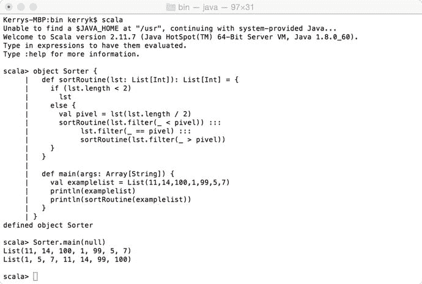
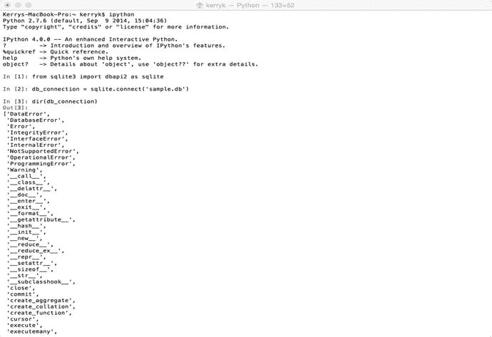
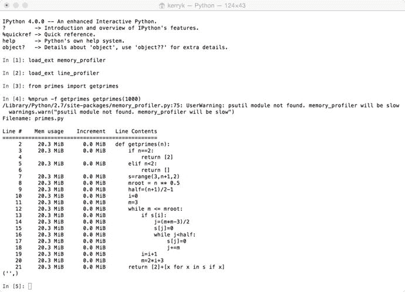

# 二、Scala 和 Python 的回顾

本章包含了整本书使用的 Scala 和 Python 编程语言的快速回顾。这里讨论的内容主要针对需要快速复习 Scala 和 Python 的 Java/C++程序员。

Note

安装 Python 的一个简单方法是安装 Anaconda Python 发行版，可以在 [`www.continuum.io/downloads`](http://www.continuum.io/downloads) 获得。Anaconda 为数学和分析提供了许多额外的 Python 库，包括对 Hadoop、Weka、R 等的支持。

## 2.1 动机:选择正确的语言定义应用程序

为正确的任务选择正确的编程语言定义了应用程序。在许多情况下，选择看起来很自然:Java 用于以 Hadoop 为中心的组件，Scala 用于以 Spark 为中心的组件。使用 Java 作为 BDA 的主要语言允许访问 Spring Framework、Apache Tika 和 Apache Camel 来提供“glueware”组件。但是，从策略上来说(取决于您的 BDA 应用程序的性质)，您可能需要包含其他语言和其他语言绑定。这反过来会影响整个技术堆栈和开发过程本身的性质。例如，一个移动应用程序可能需要与移动设备的底层代码进行交互，可能包括 Erlang 语言、C++或 C 等。

另一个需要谨慎选择编程语言的领域是用于显示和报告 BDA 结果的前端组件。如果前端仪表板和报告模块是基于 web 的，它们可能只包含不同复杂性的 JavaScript 库。然而，独立的科学应用可能是另一回事。这些可能使用 C、C++、Java 或 Python 中复杂的可视化库。

仔细控制、开发和质疑技术栈是非常重要的；但是为了选择技术栈组件及其语言绑定，我们必须首先比较语言特性。

### 2.1.1 语言特征—比较

我们现在将快速比较 Java、Scala 和 Python 为我们提供的十个最重要的特性，特别是在开发 BDA 系统方面。我们讨论的每一个特性都是现代编程语言的重要组成部分，但是对于 BDAs 来说尤其有用。这些有用的特性(我们最关心的特性)是:

*   标准的逻辑、算术和控制结构。就基本的语言结构而言，Java、Scala 和 Python 有很多共同点。
*   面向对象。我们的三种语言都有一个对象系统，Java、Scala 和 Python 之间的语法和语义有很大的不同。
*   数据库连接。因为构建 BDA 的全部目的是建立端到端的数据处理管道，所以有效处理数据源以及导出到数据接收器是整体设计和技术堆栈选择的关键考虑因素。
*   函数式编程支持。函数式编程一直是分布式应用程序开发的重要组成部分。
*   图书馆支持，特别是机器学习和统计图书馆支持。许多不同的库都是用 Java、Scala 或 Python 编写的。库和框架选择是 BDA 设计者面临的最具挑战性的问题之一。然而，您选择的库的模块化和可扩展性是有效的 BDA 设计的关键要求。特定于任务的库，如用于机器学习的 MLlib，特别有用，但会产生对 Spark 和 Scala 的依赖。记住这些依赖关系尤其重要。
*   仪表板和前端连接。通常 JavaScript 工具包和库(如 AngularJS、D3 等)足以构建复杂的仪表板和前端控件，但是——我们将在本书的其余部分看到——也有例外，特别是在移动应用程序开发中。
*   “胶件”连接和支持。这既包括以 Java 为中心的连接，也包括与其他库和框架的连接，甚至包括那些用 C++编写的库，如 Vowpal Wabbit 机器学习库。如果我们愿意，我们可以通过 web 服务，甚至通过 Java-native interface (JNI)支持库来访问 VW。
*   读取-评估-打印循环支持。除了 Java 之外，所有现代语言都有 read-eval-print 循环(REPLs ),这在 Java 9 规范中得到了弥补。
*   本机、多核支持和显式内存管理。正如我们将要讨论的，这在我们的语言之间有很大的不同。
*   与 Hadoop、Spark、NoSQL 数据库及其生态系统的连接。PySpark、Spring Data Hadoop、Apache Camel-neo4j 等工具用于连接 BDA 中可能需要的不同组件。

## 2.2 Scala 的回顾

这篇对 Scala 语言的简短回顾由五个简单的代码片段组成，它们突出了我们在介绍性章节中描述的各种语言特性。Scala 特别有趣，因为它有内置的语言特性，比如类型推断、闭包、currying 等等。Scala 还有一个复杂的对象系统:每个值都是一个对象，每个操作都是方法调用。Scala 也兼容 Java 程序。现代语言总是包括对标准数据结构、集合、数组和向量的支持。Scala 也不例外，因为 Scala 与 Java 有着非常密切的关系，所以 Java 编程中所有你熟悉的数据结构仍然适用。

Note

在本书中，我们将讨论 Scala 2 . 11 . 7 版。在命令行中输入‘scala–version’来检查您安装的 Scala 版本。你也可以通过在命令行输入‘scalac–version’来检查你的 Scala 编译器版本。

### 2.2.1 Scala 及其交互式 Shell

让我们从快速排序算法的简单实现开始，然后在 Scala 交互式 shell 中测试这个例程。你可以看到清单 2-1 是一个简单的使用递归的声明式 Scala 程序。如果您将代码扔进您的交互式 Scala shell，您将看到如图 y.y 所示的结果。Java 程序员可以立即看出 Java 和 Scala 之间的相似性:Scala 也使用 JVM，并与 Java 协同工作。甚至“package”和“import”语句都是相似的，Scala 中“packages”对代码模块的组织也与 Java 包系统相似。

请注意，和 Java 一样，Scala 提供了一个方便的面向对象的打包系统。你也可以用类似于 Java 的方式定义一个可运行的“main”方法，如清单 2-1 所示。



Figure 2-1.

```scala
/** An example of a quicksort implementation, this one uses a functional style. */

object Sorter {
  def sortRoutine(lst: List[Int]): List[Int] = {
    if (lst.length < 2)
      lst

    else {
      val pivel = lst(lst.length / 2)
      sortRoutine(lst.filter(_ < pivel)) :::
           lst.filter(_ == pivel) :::
           sortRoutine(lst.filter(_ > pivel))
    }
  }

  def main(args: Array[String]) {
    val examplelist = List(11,14,100,1,99,5,7)
    println(examplelist)
    println(sortRoutine(examplelist))
  }
}

Listing 2-1.Simple example of a Scala program which can be tried out in the interactive shell

```

```scala
Functional programming in Scala [includes the results from the Scala REPL as well]

scala> def closure1(): Int => Int = {
     | val next = 1
     | def addit(x: Int) = x + next
     | addit
     | }
closure1: ()Int => Int

scala> def closure2() = {
     | val y = 2
     | val f = closure1()
     | println(f(100))
     | }
closure2: ()Unit

Listing 2-2.An example of functional programming in Scala

```

您可以在任何交互式 Scala shells 中轻松使用 Spark，如清单 2-3 所示。

```scala
NOTE: Please make sure the bdasourcedatafile.dat file is present in your HDFS before running.

val bdaTextFile = sc.textFile("hdfs://bdasourcedatafile.dat")

val returnedErrors = bdaTextFile.filter(line => line.contains("ERROR"))
// Count all the errors
returnedErrors.count()
// Count errors mentioning ‘Pro Hadoop Analytics’
errors.filter(line => line.contains("Pro Hadoop Analytics")).count()
// Fetch the Pro Hadoop Analytics errors as an array of strings...
returnedErrors.filter(line => line.contains("Pro Hadoop Analytics")).collect()

Listing 2-3.Simple use of Apache Spark in Scala

```

```scala
KafkaWordCount program in Scala

package org.apache.spark.examples.streaming

import java.util.HashMap

import org.apache.kafka.clients.producer.{ProducerConfig, KafkaProducer, ProducerRecord}

import org.apache.spark.streaming._
import org.apache.spark.streaming.kafka._
import org.apache.spark.SparkConf

/**
 * Consumes messages from one or more topics in Kafka and does wordcount.
 * Usage: KafkaWordCount <zkQuorum> <group> <topics> <numThreads>
 *   <zkQuorum> is a list of one or more zookeeper servers that make quorum
 *   <group> is the name of kafka consumer group
 *   <topics> is a list of one or more kafka topics to consume from
 *   <numThreads> is the number of threads the kafka consumer should use
 *
 * Example:
 *    `$ bin/run-example \
 *      org.apache.spark.examples.streaming.KafkaWordCount zoo01,zoo02,zoo03 \
 *      my-consumer-group topic1,topic2 1`
 */
object KafkaWordCount {
  def main(args: Array[String]) {
    if (args.length < 4) {
      System.err.println("Usage: KafkaWordCount <zkQuorum> <group> <topics> <numThreads>")
      System.exit(1)
    }

    StreamingExamples.setStreamingLogLevels()

    val Array(zkQuorum, group, topics, numThreads) = args
    val sparkConf = new SparkConf().setAppName("KafkaWordCount")
    val ssc = new StreamingContext(sparkConf, Seconds(2))
    ssc.checkpoint("checkpoint")

    val topicMap = topics.split(",").map((_, numThreads.toInt)).toMap
    val lines = KafkaUtils.createStream(ssc, zkQuorum, group, topicMap).map(_._2)
    val words = lines.flatMap(_.split(" "))
    val wordCounts = words.map(x => (x, 1L))
      .reduceByKeyAndWindow(_ + _, _ - _, Minutes(10), Seconds(2), 2)
    wordCounts.print()

    ssc.start()
    ssc.awaitTermination()
  }
}

// Produces some random words between 1 and 100.
object KafkaWordCountProducer {

  def main(args: Array[String]) {
    if (args.length < 4) {
      System.err.println("Usage: KafkaWordCountProducer <metadataBrokerList> <topic> " +
        "<messagesPerSec> <wordsPerMessage>")
      System.exit(1)
    }

    val Array(brokers, topic, messagesPerSec, wordsPerMessage) = args

    // Zookeeper connection properties
    val props = new HashMap[String, Object]()
    props.put(ProducerConfig.BOOTSTRAP_SERVERS_CONFIG, brokers)
    props.put(ProducerConfig.VALUE_SERIALIZER_CLASS_CONFIG,
      "org.apache.kafka.common.serialization.StringSerializer")
    props.put(ProducerConfig.KEY_SERIALIZER_CLASS_CONFIG,
      "org.apache.kafka.common.serialization.StringSerializer")

    val producer = new KafkaProducerString, String

    // Send some messages
    while(true) {
      (1 to messagesPerSec.toInt).foreach { messageNum =>
        val str = (1 to wordsPerMessage.toInt).map(x => scala.util.Random.nextInt(10).toString)
          .mkString(" ")

        val message = new ProducerRecordString, String
        producer.send(message)
      }

      Thread.sleep(1000)
    }
  }

}

Listing 2-4.Scala example 4: using Apache Kafka to do word counting

```

惰性求值是一种“按需调用”的策略，可以在任何我们喜欢的语言中实现。清单 2-5 显示了一个简单的惰性评估练习的例子。

```scala
/* Object-oriented lazy evaluation in Scala */

package probdalazy

object lazyLib {

  /** Delay the evaluation of an expression until it is required. */
  def delayA: Susp[A] = new SuspImplA

  /** Get the value of a delayed expression. */
  implicit def forceA: A = s()

  /**
   * Data type of suspended computations. (The name froms from ML.)
   */
  abstract class Susp[+A] extends Function0[A]

  /**
   * Implementation of suspended computations, separated from the
   * abstract class so that the type parameter can be invariant.
   */
  class SuspImplA extends Susp[A] {
    private var maybeValue: Option[A] = None

    override def apply() = maybeValue match {
      case None =>

        val value = lazyValue
        maybeValue = Some(value)
        value
          case Some(value) =>

        value
    }

    override def toString() = maybeValue match {
      case None => "Susp(?)"
      case Some(value) => "Susp(" + value + ")"
    }
  }
}

object lazyEvaluation {
  import lazyLib._

  def main(args: Array[String]) = {
    val s: Susp[Int] = delay { println("evaluating..."); 3 }

    println("s     = " + s)       // show that s is unevaluated
    println("s()   = " + s())     // evaluate s
    println("s     = " + s)       // show that the value is saved
    println("2 + s = " + (2 + s)) // implicit call to force()

    val sl = delay { Some(3) }
    val sl1: Susp[Some[Int]] = sl
    val sl2: Susp[Option[Int]] = sl1   // the type is covariant

    println("sl2   = " + sl2)
    println("sl2() = " + sl2())
    println("sl2   = " + sl2)
  }
}

Listing 2-5.Lazy evaluation in Scala

```

## 2.3 Python 的回顾

在这一节中，我们将非常简洁地概述 Python 编程语言。Python 是构建 BDAs 的一个特别有用的资源，因为它具有高级的语言特性和与 Apache Spark 的无缝兼容性。像 Scala 和 Java 一样，Python 完全支持你所期望的所有常见数据结构类型。使用 Python 编程语言来构建 BDA 系统中的至少一些组件有很多好处。Python 在相对较短的时间内成为主流开发语言，部分原因是它是一种容易学习的语言。交互式外壳允许快速实验，并且能够以一种简单的方式尝试新的想法。有许多数字和科学库支持 Python，也有许多学习这种语言及其支持库的好书和在线教程。

Note

在整本书中，我们将使用 Python 版本 2.7.6 和交互式 Python (IPython)版本 4.0.0。要检查您已经安装的 python 版本，请在命令行上分别键入`python –version`或`ipython –version`。



图 2-2。

Simple example of an IPython program, showingdatabase connectivity Note

要运行数据库连接示例，请记住我们主要使用 Oracle 的 MySQL 数据库。这意味着您必须从 Oracle 网站下载并安装 MySQL connector for Python，该网站位于 [`https://dev.mysql.com/downloads/connector/python/2.1.html`](https://dev.mysql.com/downloads/connector/python/2.1.html) 该连接器易于安装。在 Mac 上，只需双击 dmg 文件，然后按照说明进行操作。然后，您可以使用交互式 Python shell 来测试连通性。

清单 2-6 显示了 Python 中数据库连接的一个简单例子。熟悉 Java JDBC 结构的读者会看到相似之处。这个简单的例子建立一个数据库连接，然后关闭它。在这两条语句之间，程序员可以访问指定的数据库，定义表，并执行关系查询。

```scala
Database connectivity example in Python: import, connect, and release (close)

import mysql.connector

cnx = mysql.connector.connect(user='admin', password='',
                              host='127.0.0.1',
                              database='test')
cnx.close()

Listing 2-6.
Database connectivity

code with Python

```

各种算法都很容易在 Python 中实现，并且有大量的库可以帮助您。递归的使用和所有的标准编程结构都是可用的。清单 2-7 显示了一个递归程序的简单例子。

```scala
A simple Python code example using recursion

def FlattenList(a, result=None):
    result = []
    for x in a:
        if isinstance(x, list):
            FlattenList(x, result)
            else:
                result.append(x)
                return result

            FlattenList([ [0, 1, [2, 3] ], [4, 5], 6])

Listing 2-7.Recursive Python code that flattens a list

```

就像 Java 和 Scala 一样，用 Python“import”语句包含支持包很容易。清单 2-8 中显示了一个简单的例子。

显式规划导入列表是保持 Python 程序有组织并与开发团队和使用 Python 代码的其他人保持一致的关键。

```scala
Python example using time functions

import time
size_of_vec = 1000
def pure_python_version():
    t1 = time.time()
    X = range(size_of_vec)
    Y = range(size_of_vec)
    Z = []
    for i in range(len(X)):
        Z.append(X[i] + Y[i])
    return time.time() - t1
def numpy_version():
    t1 = time.time()
    X = np.arange(size_of_vec)
    Y = np.arange(size_of_vec)
    Z = X + Y
    return time.time() - t1
t1 = pure_python_version()
t2 = numpy_version()
print(t1, t2)
print("Pro Data Analytics Numpy in this example, is: " + str(t1/t2) + " faster!")

Listing 2-8.Python code example using time functions

```

IPython 中返回的答案类似于:

```scala
Pro Data Analytics

Hadoop Numpy in this example, is:  7.75 faster!

```

NumPy 库提供了 python 编程语言的扩展。

```scala
Python example using the NumPy library

import numpy as np
from timeit import Timer
size_of_vec = 1000
def pure_python_version():
    X = range(size_of_vec)
    Y = range(size_of_vec)
    Z = []
    for i in range(len(X)):
        Z.append(X[i] + Y[i])
def numpy_version():
    X = np.arange(size_of_vec)
    Y = np.arange(size_of_vec)
    Z = X + Y
#timer_obj = Timer("x = x + 1", "x = 0")
timer_obj1 = Timer("pure_python_version()", "from __main__ import pure_python_version")
timer_obj2 = Timer("numpy_version()", "from __main__ import numpy_version")
print(timer_obj1.timeit(10))
print(timer_obj2.timeit(10))
Listing 2-9.Python code example 4: Using the NumPy Library

```

清单 2-10 显示了一个自动启动文件的例子。

```scala
Python example:  using a startup file

import os
filename = os.environ.get('PYTHONSTARTUP')
if filename and os.path.isfile(filename):
    with open(filename) as fobj:
       startup_file = fobj.read()
    exec(startup_file)

import site

site.getusersitepackages()

Listing 2-10.Python code example 5: automatic startup behavior in Python

```

## 2.4 故障排除、调试、分析和记录

故障排除，无论您使用何种语言，都涉及到在运行您的程序时识别和解决即时和严重的问题。调试也是故障排除，但意味着不太严重的困难，如意外的错误条件、逻辑错误或其他意外的程序结果。这种区别的一个例子是权限问题。如果没有文件的执行权限，就不能运行程序。您可能需要执行“chmod”命令来修复此问题。

此外，我们认为故障诊断是一个心理过程。另一方面，调试可以得到显式工具的支持，帮助您找到 bug、逻辑错误、意外情况等。

### 2.4.1 在 Python 中调试资源

在 Python 中，可以通过键入以下命令来加载 pdb 调试器:

```scala
import pdb
import yourmodule
pdb.run (‘yourmodule.test()’)

```

或者，您可以通过键入以下命令直接将`pdb`用于 Python:

```scala
python –m pdb yourprogram.py

```

对于分析 Python，Robert Kern 的非常有用的行分析器( [`https://pypi.python.org/pypi/line_profiler/1.0b3`](https://pypi.python.org/pypi/line_profiler/1.0b3) `)`)可以通过在命令行中键入以下命令来安装:

```scala
sudo pip install line_profiler

```

成功安装如图 2-3 所示。


图 2-3。

Successful installation of the line profiler package

[`http://www.huyng.com/posts/python-performance-analysis/`](http://www.huyng.com/posts/python-performance-analysis/) 对剖析 Python 程序有很好的论述。

通过键入以下命令安装内存分析器:

```scala
sudo pip install -U memory_profiler

```

为什么不通过编写一个简单的 Python 程序来生成质数、斐波那契数列或您选择的其他小例程来测试您的分析器呢？



图 2-4。

Profiling Python code using memory and line profilers

### Python 的文档

当记录 Python 代码时，看一下 python.org 的文档风格指南是非常有帮助的。这可以在以下位置找到

[`https://docs.python.org/devguide/documenting.html`](https://docs.python.org/devguide/documenting.html) 。

### 2.4.3 在 Scala 中调试资源

在这一部分，我们将讨论可以帮助你调试 Scala 程序的资源。调试程序最简单的方法之一就是在 Eclipse IDE 中安装 Scala 插件，在 Eclipse 中创建和构建 Scala 项目，并在那里调试和运行它们。关于如何做到这一点的大量教程，请参考 [`http://scala-ide.org`](http://scala-ide.org) 。

## 2.5 编程应用和示例

构建 BDA 意味着构建数据管道处理器。虽然有许多其他的方法来构思和构建软件系统——包括使用诸如敏捷之类的方法，诸如面向对象之类的技术概念，以及企业集成模式(EIPs)——但是一个不变的概念是管道概念。

## 2.6 摘要

在本章中，我们回顾了 Scala 和 Python 编程语言，并将它们与 Java 进行了比较。Hadoop 是一个以 Java 为中心的框架，而 Apache Spark 是用 Scala 编写的。大多数常用的 BDA 组件通常都有针对 Java、Scala 和 Python 的语言绑定，我们在较高层次上讨论了其中的一些组件。

每种语言都有其独特的优势，我们能够接触到 Java、Scala 和 Python 的一些合适的用例。

我们回顾了排除故障、调试、分析和记录 BDA 系统的方法，不管我们用什么语言编写 BDAs，我们还讨论了 Eclipse IDE 可用于 Python 和 Scala 的各种插件。

在下一章中，我们将着眼于 BDA 开发的必要成分:使用 Hadoop 和 Spark 构建 BDA 所必需的框架和库。

## 2.7 参考文献

鲍尔斯，迈克尔。Python 中的机器学习:预测分析的基本技术。印第安纳波利斯，约翰·威利父子公司，2015 年。

胡维茨，朱迪斯 s，考夫曼，马西娅，鲍尔斯，阿德里安。认知计算和大数据分析。印第安纳波利斯，约翰·威利父子公司，2015 年。

奥德斯基、马丁、斯普恩、莱克斯和凡纳斯、比尔。Scala 编程，第二版。加利福尼亚州核桃溪:Artima 出版社，2014 年。

杨克，杰夫。敏捷 Python 开发的基础。纽约州纽约市:纽约出版社，2008 年。

齐亚德，塔瑞克。Python 编程专家。英国伯明翰。，派克特出版社，2008 年。