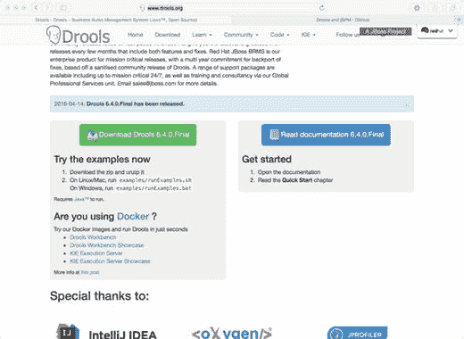
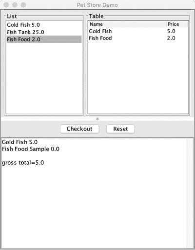
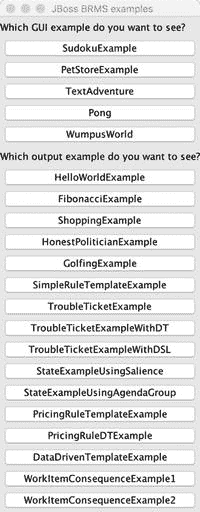
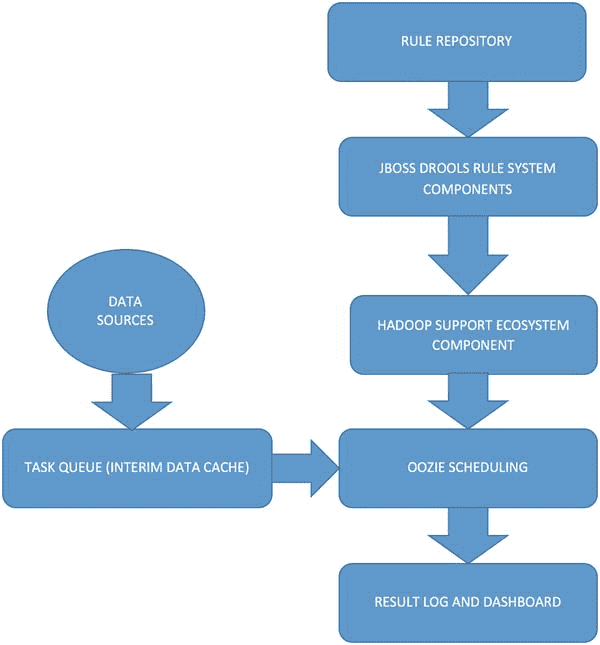
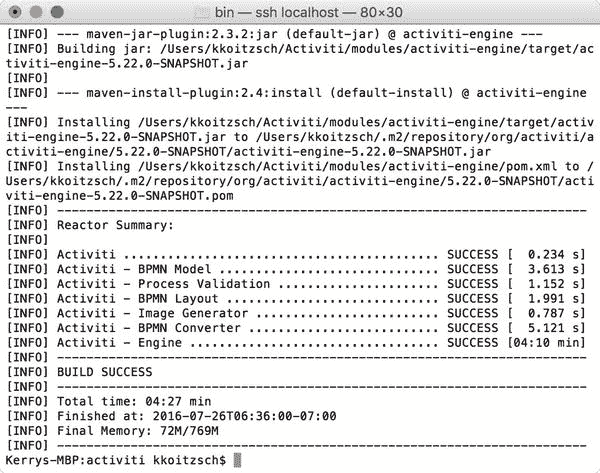
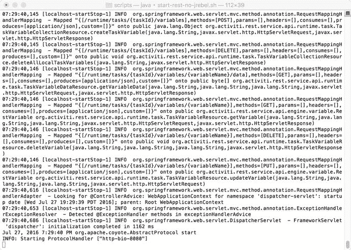
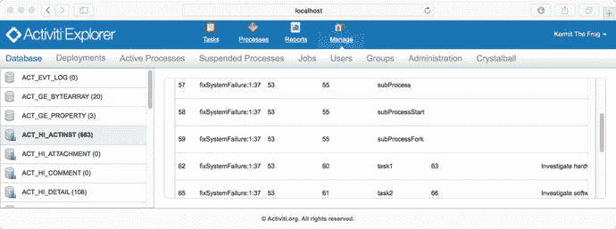
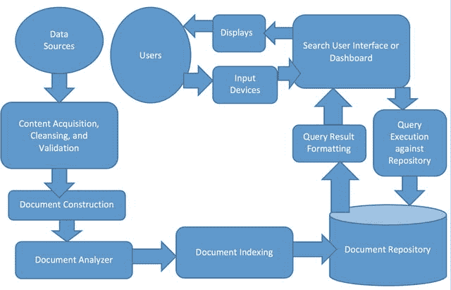

# 八、规则引擎、系统控制和系统编排

在本章中，我们将描述 JBoss Drools 规则引擎，以及如何使用它来控制和编排 Hadoop 分析管道。我们描述了一个基于规则的控制器示例，它可以与 Hadoop 生态系统结合使用，用于各种数据类型和应用程序。

Note

使用 JBoss Drools 系统的大部分配置都是通过 Maven 依赖项完成的。当我们讨论 JBoss Drools 的初始设置时，在第三章中显示了适当的依赖关系。有效使用 JBoss Drools 所需的所有依赖项都包含在示例 PROBDA 系统中，可以从代码下载站点获得。

## 8.1 规则系统介绍:JBoss Drools

JBoss Drools ( [`www.drools.org`](http://www.drools.org) )在本章的所有例子中都有使用。这不是规则引擎的唯一选择。有许多免费的规则引擎框架，但是 Drools 是一个高性能的系统，可以立即用来定义许多不同种类的控制和架构系统。JBoss Drools 还有一个优势。关于 Drools 系统(docs.jboss.org)、编程方法和优化细节，以及基于规则的技术的解释，有大量的在线和印刷文档。本章末尾列出了一些 Drools 参考书。这些提供了对基于规则的控制系统、规则机制和编辑以及其他重要细节的全面介绍。

在这一章中，我们将通过一个具体的应用来简要概述基于规则的技术:定义一个复杂事件处理器(CEP)的例子。

CEPs 是数据管道主题的一个非常有用的变体，可以用在实际系统中，包括从信用卡欺诈检测系统到复杂的工厂控制系统。

在所有的规则系统中，有两种数据结构在起作用:当然是规则，它在基于规则的系统中提供“if-then-else”条件功能(然而，我们很快就会知道，这种类型的规则，称为“正向链接”规则，并不是我们将遇到的唯一规则；还有“反向链接”规则，稍后将对其进行描述)。使用的另一种数据结构是事实，它是单独的“数据项”这些被保存在一个叫做工作记忆库的储存库中。请参见图 8-1 了解这在 Drools 系统中是如何工作的。



图 8-1。

Download the Drools software from the Drools web page Note

本书使用了 JBoss Drools 最新发布的版本，在写本书的时候是 6.4.0 版本。如果 JBoss Drools 的新版本可用并且您想要使用它，请更新 PROBDA 项目 pom.xml 中的 drools.system.version 属性。

让我们从安装 JBoss Drools 和测试一些基本功能开始。安装过程很简单。在 JBoss Drools 首页，点击下载按钮，下载 Drools 当前版本，如图 8-1 所示。

cd 到安装目录并运行 examples/run-examples.sh。您将看到一个类似于图 8-2 中的选择菜单。运行一些输出示例来测试 Drools 系统，并在控制台中观察输出，类似于图 8-3 ，或者一个面向 GUI 的示例，如图 8-4 。


图 8-4。

JBoss Drools rule system architecture



图 8-3。

JBoss Drools GUI-oriented example



图 8-2。

Select some Drools examples and observe the results to test the Drools system

内置的 Drools 示例有一个菜单，您可以从中选择不同的测试示例，如图 8-2 所示。这是测试整个系统设置并了解 JBoss Drools 系统功能的好方法。

JBoss Drools 的一些示例组件有一个关联的 UI，如图 8-3 所示。

JBoss Drools 规则系统的基本架构如图 8-4 所示。

Note

此系统中的所有示例代码都可以在 Java 包 com.apress.probda.rulesystem 中附带的示例系统代码库中找到。有关安装、版本控制和使用的其他说明，请参见相关的自述文件和文档。

在我们的系统中，带有时间戳的 Probda 事件的界面再简单不过了:

```scala
package com.probda.rulesystem.cep.model;

import java.util.Date;

public interface IEvent extends Fact {

        public abstract Date getTimestamp();
}

```

IEvent 的实现如下所示:

IEvent 的实现如下所示:

清单 8-1。一个基本的 JBoss Drools 程序

让我们以举例的方式给评估系统添加一个规则系统。只需为 drools 规则系统添加适当的依赖项(Drools 最新版本的 Google“Drools maven 依赖项”)。清单 3-2 中显示了完整的 pom.xml 文件(构建于我们的原始文件之上)。我们将在第八章的完整分析引擎示例中利用 JBoss Drools 的功能。请注意，我们提供依赖关系来连接 Drools 系统和 Apache Camel 以及 Drools 的 Spring 框架。

## 8.2 基于规则的软件系统控制

基于规则的软件系统控制可以从一个调度组件(如 Oozie)结合 JBoss Drools 或其他规则框架中的适当功能来构建，如图 8-5 中的示例架构所示。



图 8-5。

Rule-based software systems control architecture, using JBoss Drools as a controller

## 8.3 使用 JBoss Drools 的系统编排

在这一节中，我们将讨论一个简单的例子，说明如何使用 JBoss Drools 作为控制器来完成系统编排任务。我们将使用 Activiti 开源项目( [`http://activiti.org`](http://activiti.org) )以及一些如何将工作流编排器/控制器集成到基于 Spring 框架的项目中的例子。

```scala
git clone https://github.com/Activiti/Activiti.git
export ACTIVITI_HOME=/Users/kkoitzsch/activiti
             cd $ACTIVITI_HOME
mvn clean install

Don’t forget to generate the documentation by
        cd $ACTIVITI_HOME/userguide
        mvn install

Insure Tomcat is installed. On the Mac platform, do

brew install tomcat
Tomcat will then be installed at /usr/local/Cellar/tomcat/8.5.3

```

图 8-6 显示了在 Activiti 构建结束时，您可以从 Maven reactor 总结中得到什么。



图 8-6。

Maven reactor summary for Activiti system install

```scala
export TOMCAT_HOME=/usr/local/Cellar/tomcat/8.5.3
cd $ACTIVITI_HOME/scripts

```

然后运行活动脚本

```scala
./start-rest-no-jrebel.sh

```

您将看到 Activiti 成功启动，如图 8-7 所示。



图 8-7。

Activiti script running successfully

Activiti 程序成功运行的屏幕截图如图 8-7 所示。

图 8-8 显示了 Activiti Explorer 仪表盘成功运行的图片。



图 8-8。

Activiti explorer dashboard running successfully

## 8.4 带规则控制的分析引擎示例

在本节中，我们将演示一个带有规则控制的分析引擎示例。


图 8-11。

A Lucene-oriented system design, including user interactions and document processing , step 3


图 8-10。

A Lucene-oriented system design, including user interactions and document processing , step 2



图 8-9。

An initial Lucene-oriented system design, including user interactions and document processing

我们可以使用 Splunk 系统来接收数据。

我们可以使用面向时间序列的数据库，比如 OpenTSDB ( [`https://github.com/OpenTSDB/opentsdb/releases`](https://github.com/OpenTSDB/opentsdb/releases) )作为中间数据存储库。

JBoss Drools 提供了基于规则的转换。

文档库功能可以由 Cassandra 数据库的实例提供。

Note

请注意，您没有义务使用图 8-12 中所示的技术组件。根据您的应用程序需求，您可以使用另一个消息传递组件，比如 RabbitMQ，而不是 Apache Kafka，或者 MongoDB，而不是 Cassandra。


图 8-12。

An integrated system architecture with lifecycle, including the technology components used

## 8.5 总结

在本章中，我们讨论了将基于规则的控制器用于其他分布式组件，尤其是 Hadoop 和 Spark 生态系统组件。我们已经看到，基于规则的策略可以为分布式数据分析添加一个关键要素:以灵活且有逻辑的方式组织和控制数据流的能力。调度和优先化是这些基于规则的技术的自然结果，我们在本章中查看了一些基于规则的调度器的例子。

在下一章中，我们将讨论到目前为止我们所学的技术在一个集成的分析组件中的应用，它适用于各种用例以及问题域。

## 8.6 参考文献

阿玛多，卢卡斯。Drools 开发者食谱。英国伯明翰:PACKT 出版社，2012 年。

巴厘岛，米哈尔。Drools JBoss 规则 5.0 开发者指南。英国伯明翰:PACKT 出版社，2009 年。

布朗，保罗。JBoss 口水商业规则。英国伯明翰:PACKT 出版社，2009 年。

诺维格，彼得。人工智能范例:Common Lisp 案例研究。加利福尼亚州圣马特奥:摩根-考夫曼出版社，1992 年。