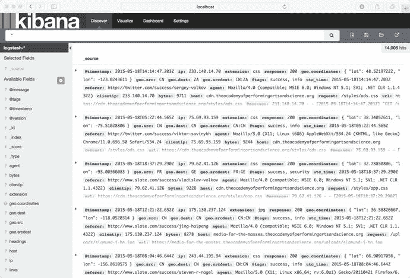
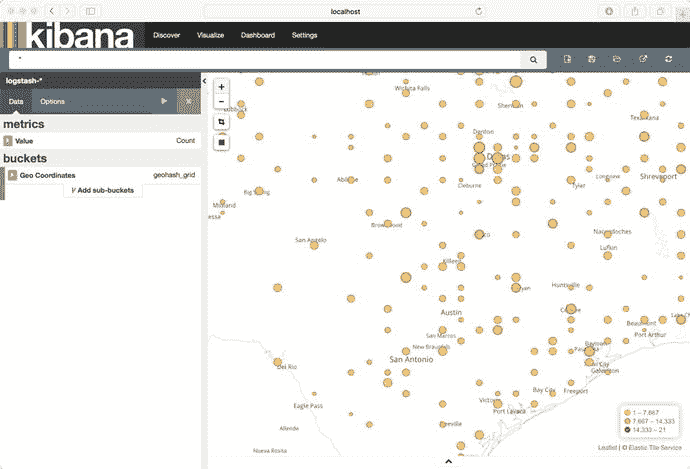
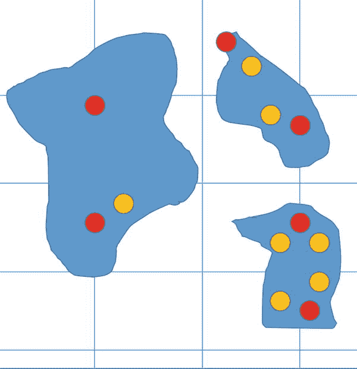
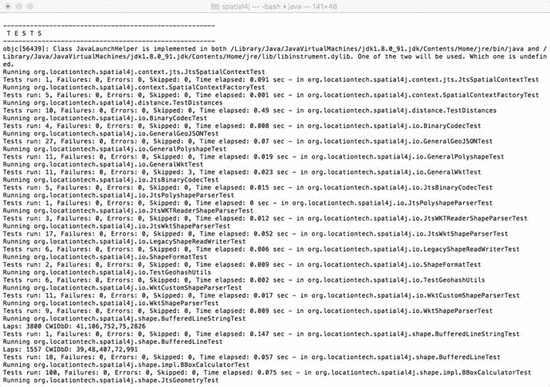
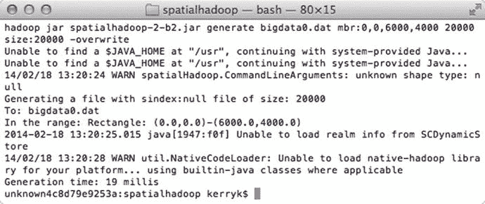

# 十三、寻找石油：Apache Mahout 地理数据分析

在本章中，我们将讨论分布式大数据分析的一个特别有趣的应用:使用一个领域模型来寻找有价值矿物的可能地理位置，如石油、铝土矿(铝矿石)或天然气。我们将介绍一些方便的技术包来获取、分析和可视化结果数据，尤其是那些非常适合处理地理位置和其他地理相关数据类型的数据。

Note

在本章中，我们使用 Elasticsearch 版。这个版本还提供了使用 MapQuest 地图可视化的工具，您将在本章和本书的其他地方看到。

## 13.1 基于域的 Apache Mahout 推理介绍

大数据分析有许多特定于领域的应用，我们可以使用 Apache Mahout 来有效地解决以领域为中心的问题。有时分析过程中涉及的知识库极其复杂；数据集可能不精确或不完整，或者数据模型可能有缺陷，考虑不周，或者根本不适合解决方案需求。Apache Mahout 作为一个久经考验的机器学习基础设施组件，以及它提供备受信任的算法和工具的方式，消除了构建基于领域的系统的一些头痛。

这种以领域为中心的应用程序的一个相关示例是“资源查找器”应用程序类型。这包括处理大量时间戳数据的分析系统(事实上，有时需要几年或几十年)；验证、协调和关联数据；然后，通过使用特定领域的数据模型，计算分析(以及作为这些分析的输出的结果数据可视化)，以识别特定“资源”(通常在地球或海洋中)的位置。不用说，数据的时间戳、校对和管理，以及地理位置数据的准确处理，是从这样的“资源查找器”系统产生准确、相关和及时的假设、解释、总结、建议和可视化的关键。


图 13-1。

An abstract component view of a geographical data analytics process

在这种类型的系统中，根据可汗的“勘探者专家系统” [`https://www.scribd.com/doc/44131016/Prospector-Expert-System`](https://www.scribd.com/doc/44131016/Prospector-Expert-System) ，通常使用四种类型的知识源:规则(类似于 JBoss Drools 系统中发现的那些)、语义网和框架(一种有点混合的方法，在 Shank 和艾贝尔森(1981)中彻底讨论过)。像其他面向对象的系统一样，框架支持继承、持久化等等。

如图 [16 所示。1](16.html#Fig1) ，我们展示了一个“假设生成器”的抽象视图，通过这种方式，我们可以预测资源位置，例如石油。这个例子的假设生成器是基于 JBoss Drools 的，我们在第 8 章[中讨论过。](08.html)


图 13-2。

A Mahout-based software component architecture for geographical data analysis

在示例程序中，我们使用一个 DBF 导入程序，如清单 [13-1](#Par15) 所示，从 DBF 导入数据。

Elasticsearch 是一个非常灵活的数据仓库，可以导入各种数据格式。

下载一些标准数据集来适应弹性搜索机制。以下是一些示例:

[T2`https://www.elastic.co/guide/en/kibana/3.0/snippets/logs.jsonl`](https://www.elastic.co/guide/en/kibana/3.0/snippets/logs.jsonl)

以及在

加载样本数据集只是为了最初测试 Elasticsearch 和 Kibana。你可以试试这些:

```scala
curl -XPOST 'localhost:9200/bank/account/_bulk?pretty' --data-binary @accounts.json
curl -XPOST 'localhost:9200/shakespeare/_bulk?pretty' --data-binary @shakespeare.json
curl -XPOST 'localhost:9200/_bulk?pretty' --data-binary @logs.jsonl

```

Note

在前一章中，我们使用 Apache Tika 来读取 DBF 文件。在这一章中，我们将使用 Sergey Polovko (Jamel)的另一种 DBF 读本。你可以从 GitHub 的 [`https://github.com/jamel/dbf`](https://github.com/jamel/dbf) 下载这个 DBF 阅读器。

```scala
package com.apress.probda.applications.oilfinder;

import java.io.File;
import java.util.Date;
import java.util.List;

/** We use a standard DBF reader from github.
 *
 */
import org.jamel.dbf.processor.DbfProcessor;
import org.jamel.dbf.processor.DbfRowMapper;
import org.jamel.dbf.utils.DbfUtils;

public class Main {

        static int rownum = 0;

        public static void main(String[] args) {
        File dbf = new File("BHL_GCS_NAD27.dbf"); // pass in as args[0]

        List<OilData> oildata = DbfProcessor.loadData(dbf, new DbfRowMapper<OilData>() {
            @Override
            public OilData mapRow(Object[] row) {

                for (Object o : row) {

                        System.out.println("Row object:  " + o);

                }
                System.out.println("....Reading row: " + rownum + " into elasticsearch....");

                rownum++;

                System.out.println("------------------------");
                return new OilData(); // customize your constructor here
           }
        });

       // System.out.println("Oil Data: " + oildata);
    }
}

/** We will flesh out this information class as we develop the example.
 *
 * @author kkoitzsch
 *
 */
class OilData {

        String _name;
        int _value;
        Date _createdAt;

        public OilData(String... args){

        }

        public OilData(){

        }

        public OilData(String name, int intValue, Date createdAt) {
                _name = name;
                _value = intValue;
                _createdAt = createdAt;
        }

}

Listing 13-1.A simple DBF reader for geological data source information

```

当然，阅读地理数据(包括 DBF 文件)只是分析过程的第一步。



图 13-3。

A test query to verify Elasticsearch has been populated correctly with test data sets

使用 Elasticsearch-Hadoop 连接器( [`https://www.elastic.co/products/hadoop`](https://www.elastic.co/products/hadoop) `)`)将 Elasticsearch 与基于 Hadoop 的应用程序组件连接起来。

要了解更多关于 Hadoop-Elasticsearch 连接器的信息，请参考网页 [`http://www.elastic.co/guide/en/elasticsearch/hadoop/index.html`](http://www.elastic.co/guide/en/elasticsearch/hadoop/index.html) 。


图 13-4。

The Elasticserch-Hadoop connector and its relationship to the Hadoop ecosystem and HDFS

我们可以将 Elasticsearch-Hadoop 连接器与 SpatialHadoop 结合使用，为我们想要处理的基于地理位置的数据提供分布式分析功能。

我们可以设定值的阈值，并提供对“兴趣点”(间距、每个类别有多少个兴趣点，以及其他因素)的约束，以生成显示预期结果可能性的可视化。

某些期望结果的证据和概率可以存储在同一个数据结构中，如图 [13-5](#Fig5) 所示。蓝色区域表示有证据支持预期结果的可能性，在这种情况下，表示存在石油或石油相关产品。红色和黄色圆圈表示假设空间中的高兴趣点和中等兴趣点。如果网格坐标恰好是地理位置，人们可以在类似于图 [13-6](#Fig6) 和图 [13-7](#Fig7) 所示的地图上绘制由此产生的假设。


图 13-7。

Using the Spatial Solr Sandbox tool to query a Solr repository for geolocation data



图 13-6。

Using Kibana and Elasticsearch for map visualiation in Texas example using latitude and logitude, and simple counts of an attribute



图 13-5。

Probability/evidence grid: a simple example of grid-based hypothesis analytic

我们可以运行简单的测试来确保 Kibana 和 Elasticsearch 正确显示我们的地理位置数据。

现在是时候描述我们的 Mahout 分析组件了。对于这个例子，我们将保持分析非常简单，以概述我们的思维过程。不用说，现实世界资源寻找者的数学模型需要更加复杂，适应性更强，并允许数学模型中有更多的变量。

我们可以使用另一个非常有用的工具，通过 Ryan McKinley 的 Spatial Solr 沙盒工具( [`https://github.com/ryantxu/spatial-solr-sandbox`](https://github.com/ryantxu/spatial-solr-sandbox) )来原型化和查看驻留在 Solr 中的一些数据内容。

## 13.2 智能制图系统和 Hadoop 分析

智能制图(SC)系统是一种特殊类型的基于数据管道的软件应用程序，用于处理卫星图像，将卫星图像与已知精度的图像数据库(称为“地面实况”数据库)进行比较。地面实况数据库提供标准化的地理位置信息(例如矩形图像的四个角的纬度和经度、图像分辨率、比例和方向参数)以及帮助匹配过程的其他信息。

SC 系统向人工评估团队提供有用的图像匹配反馈，并可以帮助工程师和质量保证人员交互式地查看、验证、编辑、注释和比较输入的卫星图像与“地面实况”图像和元数据。由于消除了由于疲劳、观察误差等引起的人为误差，使用 SC 系统可以使一小组分析员在更短的时间内完成一个更大的评估小组的工作，并得到更准确的结果。

SC 系统可以使用各种传感器类型、图像格式、图像分辨率和数据摄取率，并可以使用机器学习技术、基于规则的技术或推理过程来改进和调整特征识别，以便在卫星图像特征(如位置(纬度经度信息)、图像特征(如湖泊、道路、飞机跑道或河流)和人造物体(如建筑物)之间进行更准确和有效的匹配。购物中心或机场)。

SC 系统的用户可以提供关于所计算的匹配的准确性的反馈，这反过来允许随着时间的推移，随着细化的进行，匹配过程变得更加准确。该系统可以专门对用户选择的特征进行操作，例如道路网络或诸如建筑物的人造特征。

最后，SC 匹配过程以报告或仪表板显示的形式向用户提供图像和地面真实数据之间匹配的准确性测量，以及完整的误差和异常值信息。

SC 系统可以提供一种高效且经济的方法来评估卫星图像的质量、精度和图像序列内的一致性，并可以解决高分辨率精度、任务完成时间、可扩展性和卫星图像的近实时处理等问题，以及为各种卫星图像评估任务提供高性能软件解决方案。

以地理位置为中心的系统中包含的一个有用的组件是 Spatial4j ( [`https://github.com/locationtech/spatial4j`](https://github.com/locationtech/spatial4j) )，这是一个为 Java 程序提供空间和地理位置功能的助手库，它是从一些早期的工作(如前面讨论的 Spatial Solr 沙盒工具包)发展而来的。



图 13-8。

Running the tests for Spatial4j, a commonly used geolocation java toolkit library

另一个有用的软件库是 SpatialHadoop ( `http://spatialhadoop.cs.umn.edu` `)`)，这是 Hadoop 本身的一个基于 MapReduce 的扩展。SpatialHadoop 提供空间数据类型、索引和操作，允许使用简单的高级语言来控制基于 Hadoop 的程序对以地理位置为中心的数据的处理。



图 13-9。

Generating a data file for use with SpatialHadoop

## 13.3 摘要

在本章中，我们讨论了使用大数据分析作为工具来搜索石油和其他自然资源的理论和实践。我们能够加载 DBF 数据，用基于 Mahout =的代码操作和分析数据，并将结果输出到一个简单的可视化工具。我们还讨论了一些包含在任何以地理位置为中心的应用程序中的有用的库，比如 Spatial4j 和 SpatialHadoop。

在下一章，我们将讨论大数据分析的一个特别有趣的领域:使用图像及其元数据作为我们分析管道的数据源。

## 13.4 参考

乔戈、拉杜、辛曼、马修·李和鲁索、罗伊。弹性搜索在行动。塞瓦斯托波尔，加利福尼亚州:奥赖利出版社，2015 年。

贾科姆利，皮耶罗。阿帕奇看象人食谱。英国伯明翰:PACKT 出版社，2013 年。

肖恩·欧文、罗宾·阿尼尔、泰德·邓宁和艾伦·弗里德曼。看象人在行动。纽约州谢尔特岛:曼宁出版公司，2011 年。